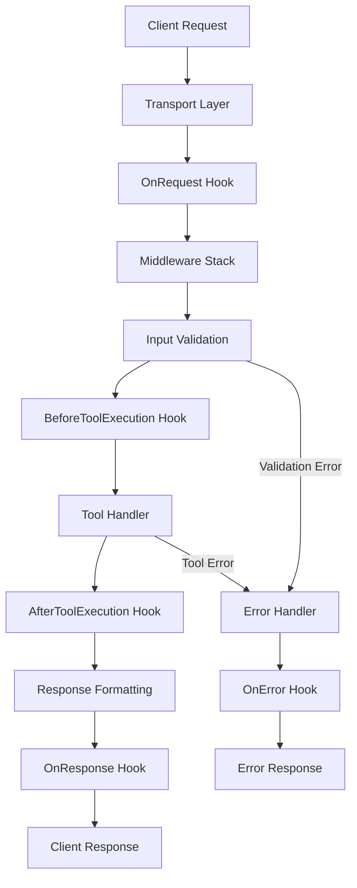
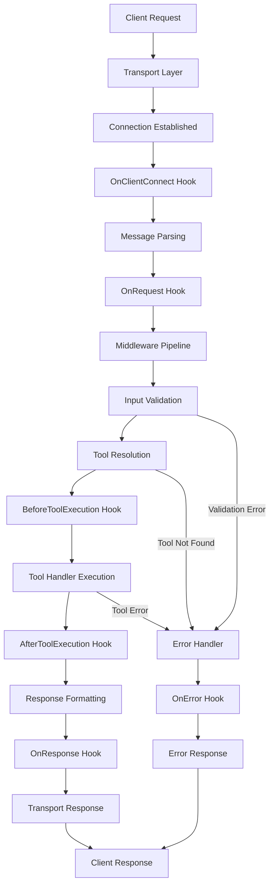

# MCP Accelerator Documentation

> Documentation combinée générée le Thu Oct  9 19:33:37 CEST 2025


---

## uindex

*Fichier source: `index.md`*


---

## uguides - getting-started

*Fichier source: `guides/getting-started.md`*

# Getting Started with MCP Accelerator

Welcome to MCP Accelerator! This guide will help you create your first MCP server in minutes.

## 🚀 Quick Start

### Prerequisites

- **Node.js** 18+ 
- **TypeScript** 5.3+
- **npm** or **yarn**

### Installation

```bash
# Install the core package
npm install @mcp-accelerator/core

# Or install specific packages
npm install @mcp-accelerator/transport-http
npm install @mcp-accelerator/middleware-auth
```

### Your First MCP Server

Create a new file `my-server.ts`:

```typescript
import { MCPServer, ToolDefinition } from '@mcp-accelerator/core';
import { HTTPTransport } from '@mcp-accelerator/transport-http';

// Define a simple tool
const echoTool: ToolDefinition = {
  name: 'echo',
  description: 'Echo back the input message',
  inputSchema: {
    type: 'object',
    properties: {
      message: {
        type: 'string',
        description: 'Message to echo back'
      }
    },
    required: ['message']
  }
};

// Create and configure the server
const server = new MCPServer({
  name: 'My First MCP Server',
  version: '1.0.0'
});

// Register the tool
server.addTool(echoTool, async (input) => {
  return {
    content: [
      {
        type: 'text',
        text: `Echo: ${input.message}`
      }
    ]
  };
});

// Start the server with HTTP transport
const transport = new HTTPTransport({
  port: 3000,
  host: 'localhost'
});

server.start(transport);
console.log('🚀 Server running on http://localhost:3000');
```

### Run Your Server

```bash
# Compile TypeScript
npx tsc my-server.ts

# Run the server
node my-server.js
```

### Test Your Server

```bash
# Test with curl
curl -X POST http://localhost:3000/tools/echo \
  -H "Content-Type: application/json" \
  -d '{"message": "Hello MCP!"}'
```

Expected response:
```json
{
  "content": [
    {
      "type": "text",
      "text": "Echo: Hello MCP!"
    }
  ]
}
```

## 🎯 Key Concepts

### 1. **MCPServer**
The main server class that manages tools, middleware, and lifecycle.

### 2. **Tools**
Functions that can be called by MCP clients. Each tool has:
- `name`: Unique identifier
- `description`: Human-readable description
- `inputSchema`: JSON Schema for input validation
- `handler`: Async function that processes the input

### 3. **Transports**
How your server communicates:
- **HTTP**: REST API over HTTP
- **WebSocket**: Real-time bidirectional communication
- **SSE**: Server-sent events for streaming
- **STDIO**: Standard input/output for CLI tools

### 4. **Middleware**
Plugins that add functionality:
- **Authentication**: API keys, JWT tokens
- **CORS**: Cross-origin resource sharing
- **Rate Limiting**: Request throttling
- **Observability**: Logging, metrics, tracing

## 📚 Next Steps

Now that you have a basic server running, explore:

1. **[Core Concepts](./core-concepts.md)** - Deep dive into the architecture
2. **[Transport Layer](./transports.md)** - Choose the right transport for your use case
3. **[Middleware System](./middleware.md)** - Add authentication, rate limiting, and more
4. **[Examples](../examples/)** - See real-world implementations

## 🆘 Need Help?

- Check the [API Reference](../api/core.md) for detailed documentation
- Browse [examples](../examples/) for inspiration
- Join [GitHub Discussions](https://github.com/mjfphp/mcrapid/discussions) for community support
- Report issues on [GitHub Issues](https://github.com/mjfphp/mcrapid/issues)


---

## uguides - core-concepts

*Fichier source: `guides/core-concepts.md`*

# Core Concepts

Understanding the fundamental concepts of MCP Accelerator will help you build robust and scalable MCP servers.

## 🏗️ Architecture Overview

MCP Accelerator follows a modular architecture with clear separation of concerns:

```
┌─────────────────┐    ┌──────────────────┐    ┌─────────────────┐
│   MCP Client    │    │   MCP Accelerator │    │   Your Tools    │
│                 │◄──►│                  │◄──►│                 │
│  (Claude, etc.) │    │                  │    │  (Business      │
│                 │    │  ┌─────────────┐ │    │   Logic)        │
└─────────────────┘    │  │   Core      │ │    └─────────────────┘
                       │  │   Server    │ │
                       │  └─────────────┘ │
                       │  ┌─────────────┐ │
                       │  │ Middleware  │ │
                       │  │   Stack     │ │
                       │  └─────────────┘ │
                       │  ┌─────────────┐ │
                       │  │  Transport  │ │
                       │  │    Layer    │ │
                       │  └─────────────┘ │
                       └──────────────────┘
```

## 🎯 Key Components

### 1. MCPServer (Core)

The central orchestrator that manages the entire MCP server lifecycle.

```typescript
import { MCPServer } from '@mcp-accelerator/core';

const server = new MCPServer({
  name: 'My Server',
  version: '1.0.0',
  description: 'A powerful MCP server'
});
```

**Responsibilities:**
- Tool registration and management
- Request routing and validation
- Lifecycle event coordination
- Error handling and logging

### 2. Tools

Tools are the core functionality of your MCP server. Each tool represents a capability that clients can invoke.

```typescript
interface ToolDefinition {
  name: string;                    // Unique identifier
  description: string;             // Human-readable description
  inputSchema: JSONSchema;         // Input validation schema
  handler: ToolHandler;           // Async function that processes requests
}
```

**Tool Lifecycle:**
1. **Registration**: Tool is registered with the server
2. **Validation**: Input is validated against the schema
3. **Execution**: Handler function is called with validated input
4. **Response**: Result is formatted and returned to client

### 3. Transports

Transports define how your server communicates with MCP clients.

#### HTTP Transport
```typescript
import { HTTPTransport } from '@mcp-accelerator/transport-http';

const transport = new HTTPTransport({
  port: 3000,
  host: 'localhost',
  // Exposes Fastify options
  serverOptions: {
    logger: true,
    trustProxy: true
  }
});
```

#### WebSocket Transport
```typescript
import { WebSocketTransport } from '@mcp-accelerator/transport-websocket';

const transport = new WebSocketTransport({
  port: 3000,
  // WebSocket-specific options
  pingInterval: 30000,
  maxConnections: 100
});
```

#### STDIO Transport
```typescript
import { STDIOTransport } from '@mcp-accelerator/transport-stdio';

const transport = new STDIOTransport({
  // For CLI tools and direct integration
});
```

### 4. Middleware

Middleware adds cross-cutting concerns like authentication, logging, and rate limiting.

```typescript
// Middleware execution order (by priority)
server.use(new AuthenticationMiddleware({ /* config */ }));  // Priority: 100
server.use(new RateLimitMiddleware({ /* config */ }));       // Priority: 90
server.use(new CORSMiddleware({ /* config */ }));            // Priority: 80
server.use(new LoggingMiddleware({ /* config */ }));         // Priority: 70
```

## 🔄 Request Lifecycle

Understanding the request lifecycle helps you debug issues and optimize performance:



### Lifecycle Hooks

```typescript
// Request lifecycle hooks
server.onRequest((context) => {
  console.log('Request started:', context.request);
  context.startTime = Date.now();
});

server.onResponse((context) => {
  const duration = Date.now() - context.startTime;
  console.log('Request completed in:', duration, 'ms');
});

server.onError((context) => {
  console.error('Request failed:', context.error);
});

// Tool execution hooks
server.beforeToolExecution((context) => {
  console.log('Executing tool:', context.toolName);
});

server.afterToolExecution((context) => {
  console.log('Tool completed:', context.result);
});
```

## 🛡️ Error Handling

MCP Accelerator provides robust error handling with standardized error types:

### Error Types

```typescript
enum MCPErrorCode {
  VALIDATION_ERROR = 'VALIDATION_ERROR',
  TOOL_NOT_FOUND = 'TOOL_NOT_FOUND',
  INTERNAL_ERROR = 'INTERNAL_ERROR',
  TIMEOUT = 'TIMEOUT',
  RATE_LIMITED = 'RATE_LIMITED',
  UNAUTHORIZED = 'UNAUTHORIZED'
}
```

### Creating Errors

```typescript
import { createMCPError, MCPErrorCode } from '@mcp-accelerator/core';

// Simple error
throw createMCPError(MCPErrorCode.VALIDATION_ERROR, 'Invalid input');

// Error with details
throw createMCPError(
  MCPErrorCode.INTERNAL_ERROR,
  'Database connection failed',
  { 
    error: 'Connection timeout',
    retryAfter: 30 
  }
);
```

### Safe Tool Handlers

Use the `safeHandler` utility to prevent crashes:

```typescript
import { safeHandler } from '@mcp-accelerator/core';

const robustTool = safeHandler(
  async (input) => {
    // Your tool logic here
    return await processInput(input);
  },
  {
    timeout: 5000,        // 5 second timeout
    retry: {              // Retry configuration
      attempts: 3,
      delay: 1000
    },
    circuitBreaker: {     // Circuit breaker
      threshold: 5,
      timeout: 30000
    }
  }
);

server.addTool(toolDefinition, robustTool);
```

## 🔍 Observability

Built-in observability features help you monitor and debug your MCP server:

### Metrics

```typescript
// Built-in metrics
server.getMetrics(); // Returns Prometheus-compatible metrics

// Custom metrics
server.addCustomMetric('tool_executions_total', 'counter');
server.addCustomMetric('request_duration_seconds', 'histogram');
```

### Logging

```typescript
// Structured logging with context
server.logger.info('Tool executed', {
  toolName: 'search',
  duration: 150,
  userId: 'user123'
});

// Error logging with stack traces
server.logger.error('Tool failed', error, {
  toolName: 'search',
  input: sanitizedInput
});
```

### Tracing

```typescript
// OpenTelemetry integration
import { createTracer } from '@mcp-accelerator/middleware-observability';

const tracer = createTracer('my-mcp-server');

server.use(new TracingMiddleware({ tracer }));
```

## 🚀 Performance Considerations

### 1. Tool Registration

Register tools once during server initialization:

```typescript
// ✅ Good - Register during setup
server.addTool(searchTool, searchHandler);
server.addTool(analyzeTool, analyzeHandler);

// ❌ Avoid - Don't register tools per request
```

### 2. Input Validation

Use efficient JSON Schema validation:

```typescript
// ✅ Good - Specific schemas
const schema = {
  type: 'object',
  properties: {
    query: { type: 'string', maxLength: 1000 },
    limit: { type: 'number', minimum: 1, maximum: 100 }
  },
  required: ['query']
};

// ❌ Avoid - Overly permissive schemas
const schema = {
  type: 'object'
};
```

### 3. Resource Management

Clean up resources properly:

```typescript
// Graceful shutdown
process.on('SIGTERM', async () => {
  await server.stop();
  process.exit(0);
});

process.on('SIGINT', async () => {
  await server.stop();
  process.exit(0);
});
```

## 🔐 Security Best Practices

### 1. Input Sanitization

Always validate and sanitize inputs:

```typescript
import { z } from 'zod';

const inputSchema = z.object({
  query: z.string().max(1000).regex(/^[a-zA-Z0-9\s]+$/),
  userId: z.string().uuid()
});

const handler = safeHandler(async (input) => {
  const validated = inputSchema.parse(input);
  // Process validated input
});
```

### 2. Authentication

Use middleware for authentication:

```typescript
import { JWTAuthMiddleware } from '@mcp-accelerator/middleware-auth';

server.use(new JWTAuthMiddleware({
  secret: process.env.JWT_SECRET,
  algorithms: ['HS256']
}));
```

### 3. Rate Limiting

Protect against abuse:

```typescript
import { RateLimitMiddleware } from '@mcp-accelerator/middleware-ratelimit';

server.use(new RateLimitMiddleware({
  windowMs: 15 * 60 * 1000, // 15 minutes
  max: 100,                 // Limit each IP to 100 requests per windowMs
  keyGenerator: (req) => req.ip
}));
```

## 📚 Next Steps

Now that you understand the core concepts:

1. **[Transport Layer](./transports.md)** - Choose the right transport for your use case
2. **[Middleware System](./middleware.md)** - Add authentication, rate limiting, and more
3. **[Error Handling](./error-handling.md)** - Implement robust error handling
4. **[Production Deployment](./production.md)** - Deploy to production safely


---

## uguides - middleware

*Fichier source: `guides/middleware.md`*

# Middleware System

The middleware system in MCP Accelerator provides a powerful plugin architecture for adding cross-cutting concerns to your MCP server. This guide covers all available middleware and how to create custom middleware.

## 🏗️ Middleware Architecture

Middleware in MCP Accelerator follows a pipeline pattern where each middleware can:
- Process the request before it reaches the tool handler
- Process the response after the tool handler completes
- Short-circuit the pipeline by throwing an error
- Add metadata and context to requests

```typescript
interface Middleware {
  name: string;
  priority: number;
  execute(context: MiddlewareContext, next: NextFunction): Promise<void>;
}
```

### Execution Order

Middleware executes in **priority order** (highest to lowest):

```typescript
// Higher priority = executes first
server.use(new AuthenticationMiddleware({ priority: 100 }));
server.use(new RateLimitMiddleware({ priority: 90 }));
server.use(new CORSMiddleware({ priority: 80 }));
server.use(new LoggingMiddleware({ priority: 70 }));
```

## 🛡️ Built-in Middleware

### 1. Authentication Middleware

**Package:** `@mcp-accelerator/middleware-auth`

Provides JWT and API key authentication.

#### JWT Authentication

```typescript
import { JWTAuthMiddleware } from '@mcp-accelerator/middleware-auth';

server.use(new JWTAuthMiddleware({
  secret: process.env.JWT_SECRET,
  algorithms: ['HS256'],
  issuer: 'mcp-server',
  audience: 'mcp-clients',
  ignoreExpiration: false,
  clockTolerance: 30
}));
```

**Configuration:**
- `secret`: JWT secret key
- `algorithms`: Allowed signing algorithms
- `issuer`: Expected JWT issuer
- `audience`: Expected JWT audience
- `ignoreExpiration`: Skip expiration check
- `clockTolerance`: Clock skew tolerance in seconds

#### API Key Authentication

```typescript
import { APIKeyAuthMiddleware } from '@mcp-accelerator/middleware-auth';

server.use(new APIKeyAuthMiddleware({
  apiKeys: new Map([
    ['key1', { permissions: ['read', 'write'], userId: 'user1' }],
    ['key2', { permissions: ['read'], userId: 'user2' }]
  ]),
  headerName: 'X-API-Key',
  queryParam: 'api_key'
}));
```

### 2. CORS Middleware

**Package:** `@mcp-accelerator/middleware-cors`

Handles Cross-Origin Resource Sharing.

```typescript
import { CORSMiddleware } from '@mcp-accelerator/middleware-cors';

server.use(new CORSMiddleware({
  origin: ['https://example.com', 'https://app.example.com'],
  credentials: true,
  methods: ['GET', 'POST', 'OPTIONS'],
  allowedHeaders: ['Content-Type', 'Authorization', 'X-Requested-With'],
  exposedHeaders: ['X-Rate-Limit-Remaining'],
  maxAge: 86400
}));
```

**Configuration:**
- `origin`: Allowed origins (array, string, or function)
- `credentials`: Allow credentials
- `methods`: Allowed HTTP methods
- `allowedHeaders`: Allowed request headers
- `exposedHeaders`: Headers exposed to client
- `maxAge`: Preflight cache duration

### 3. Rate Limiting Middleware

**Package:** `@mcp-accelerator/middleware-ratelimit`

Protects against abuse and DoS attacks.

```typescript
import { RateLimitMiddleware } from '@mcp-accelerator/middleware-ratelimit';

server.use(new RateLimitMiddleware({
  windowMs: 15 * 60 * 1000, // 15 minutes
  max: 100, // Limit each IP to 100 requests per windowMs
  keyGenerator: (req) => req.headers['x-forwarded-for'] || req.ip,
  skipSuccessfulRequests: false,
  skipFailedRequests: false,
  standardHeaders: true,
  legacyHeaders: false
}));
```

**Configuration:**
- `windowMs`: Time window in milliseconds
- `max`: Maximum requests per window
- `keyGenerator`: Function to generate rate limit key
- `skipSuccessfulRequests`: Skip successful requests
- `skipFailedRequests`: Skip failed requests
- `standardHeaders`: Add standard rate limit headers
- `legacyHeaders`: Add legacy rate limit headers

### 4. Resilience Middleware

**Package:** `@mcp-accelerator/middleware-resilience`

Provides circuit breaker, retry, and timeout functionality.

#### Circuit Breaker

```typescript
import { CircuitBreakerMiddleware } from '@mcp-accelerator/middleware-resilience';

server.use(new CircuitBreakerMiddleware({
  threshold: 5, // Number of failures before opening
  timeout: 30000, // How long to wait before trying again
  resetTimeout: 60000, // How long to wait before resetting
  monitoringPeriod: 10000, // How often to check circuit state
  errorFilter: (error) => error.code === 'TIMEOUT' || error.code === 'NETWORK_ERROR'
}));
```

#### Retry Middleware

```typescript
import { RetryMiddleware } from '@mcp-accelerator/middleware-resilience';

server.use(new RetryMiddleware({
  attempts: 3,
  delay: 1000,
  backoff: 'exponential', // 'linear' | 'exponential'
  maxDelay: 10000,
  retryCondition: (error) => error.code === 'TIMEOUT'
}));
```

#### Timeout Middleware

```typescript
import { TimeoutMiddleware } from '@mcp-accelerator/middleware-resilience';

server.use(new TimeoutMiddleware({
  timeout: 30000, // 30 seconds
  onTimeout: (context) => {
    console.log('Request timed out:', context.request.toolName);
  }
}));
```

### 5. Observability Middleware

**Package:** `@mcp-accelerator/middleware-observability`

Provides logging, metrics, and tracing.

```typescript
import { ObservabilityMiddleware } from '@mcp-accelerator/middleware-observability';
import { createTracer } from '@mcp-accelerator/middleware-observability';

const tracer = createTracer('my-mcp-server');

server.use(new ObservabilityMiddleware({
  tracer,
  metrics: true,
  logging: true,
  samplingRate: 0.1, // Sample 10% of requests
  customMetrics: {
    'custom_metric_total': 'counter',
    'custom_duration_seconds': 'histogram'
  }
}));
```

## 🔧 Custom Middleware

### Creating Custom Middleware

```typescript
import { Middleware, MiddlewareContext, NextFunction } from '@mcp-accelerator/core';

class CustomMiddleware implements Middleware {
  name = 'custom';
  priority = 85;

  constructor(private options: CustomMiddlewareOptions) {}

  async execute(context: MiddlewareContext, next: NextFunction): Promise<void> {
    const startTime = Date.now();
    
    try {
      // Pre-processing
      this.preProcess(context);
      
      // Call next middleware or tool handler
      await next();
      
      // Post-processing
      this.postProcess(context, Date.now() - startTime);
    } catch (error) {
      // Error handling
      this.handleError(context, error);
      throw error;
    }
  }

  private preProcess(context: MiddlewareContext): void {
    // Add custom headers, validate request, etc.
    context.request.customData = this.extractCustomData(context.request);
  }

  private postProcess(context: MiddlewareContext, duration: number): void {
    // Log metrics, update cache, etc.
    this.recordMetrics(context, duration);
  }

  private handleError(context: MiddlewareContext, error: Error): void {
    // Custom error handling
    this.logError(context, error);
  }

  private extractCustomData(request: any): any {
    // Extract custom data from request
    return {
      userAgent: request.headers?.['user-agent'],
      timestamp: new Date().toISOString()
    };
  }

  private recordMetrics(context: MiddlewareContext, duration: number): void {
    // Record custom metrics
    console.log(`Request to ${context.request.toolName} took ${duration}ms`);
  }

  private logError(context: MiddlewareContext, error: Error): void {
    console.error(`Error in ${context.request.toolName}:`, error.message);
  }
}

// Usage
server.use(new CustomMiddleware({
  // custom options
}));
```

### Middleware Context

```typescript
interface MiddlewareContext {
  clientId: string;
  request: MCPRequest;
  response?: MCPResponse;
  error?: Error;
  metadata: Record<string, any>;
  logger: Logger;
  metrics: MetricsCollector;
}
```

### Next Function

```typescript
type NextFunction = () => Promise<void>;
```

## 🎯 Middleware Patterns

### 1. Request Validation

```typescript
class ValidationMiddleware implements Middleware {
  name = 'validation';
  priority = 95;

  async execute(context: MiddlewareContext, next: NextFunction): Promise<void> {
    // Validate request format
    if (!this.isValidRequest(context.request)) {
      throw createMCPError(
        MCPErrorCode.VALIDATION_ERROR,
        'Invalid request format'
      );
    }

    await next();
  }

  private isValidRequest(request: MCPRequest): boolean {
    // Custom validation logic
    return request.toolName && typeof request.toolName === 'string';
  }
}
```

### 2. Request Logging

```typescript
class RequestLoggingMiddleware implements Middleware {
  name = 'requestLogging';
  priority = 60;

  async execute(context: MiddlewareContext, next: NextFunction): Promise<void> {
    const startTime = Date.now();
    
    context.logger.info('Request started', {
      toolName: context.request.toolName,
      clientId: context.clientId,
      timestamp: new Date().toISOString()
    });

    try {
      await next();
      
      const duration = Date.now() - startTime;
      context.logger.info('Request completed', {
        toolName: context.request.toolName,
        clientId: context.clientId,
        duration,
        status: 'success'
      });
    } catch (error) {
      const duration = Date.now() - startTime;
      context.logger.error('Request failed', error, {
        toolName: context.request.toolName,
        clientId: context.clientId,
        duration,
        status: 'error'
      });
      throw error;
    }
  }
}
```

### 3. Response Transformation

```typescript
class ResponseTransformMiddleware implements Middleware {
  name = 'responseTransform';
  priority = 10; // Low priority, runs last

  async execute(context: MiddlewareContext, next: NextFunction): Promise<void> {
    await next();
    
    // Transform response if needed
    if (context.response) {
      context.response = this.transformResponse(context.response);
    }
  }

  private transformResponse(response: MCPResponse): MCPResponse {
    // Add custom headers, modify content, etc.
    return {
      ...response,
      metadata: {
        ...response.metadata,
        transformedAt: new Date().toISOString()
      }
    };
  }
}
```

### 4. Caching

```typescript
class CachingMiddleware implements Middleware {
  name = 'caching';
  priority = 75;

  private cache = new Map<string, { data: any; expiry: number }>();

  async execute(context: MiddlewareContext, next: NextFunction): Promise<void> {
    const cacheKey = this.generateCacheKey(context.request);
    
    // Check cache
    const cached = this.cache.get(cacheKey);
    if (cached && cached.expiry > Date.now()) {
      context.response = cached.data;
      return;
    }

    await next();

    // Cache response
    if (context.response) {
      this.cache.set(cacheKey, {
        data: context.response,
        expiry: Date.now() + this.options.ttl
      });
    }
  }

  private generateCacheKey(request: MCPRequest): string {
    return `${request.toolName}:${JSON.stringify(request.input)}`;
  }
}
```

## 🔄 Middleware Composition

### Conditional Middleware

```typescript
class ConditionalMiddleware implements Middleware {
  name = 'conditional';
  priority = 85;

  constructor(
    private condition: (context: MiddlewareContext) => boolean,
    private middleware: Middleware
  ) {}

  async execute(context: MiddlewareContext, next: NextFunction): Promise<void> {
    if (this.condition(context)) {
      await this.middleware.execute(context, next);
    } else {
      await next();
    }
  }
}

// Usage
server.use(new ConditionalMiddleware(
  (context) => context.request.toolName === 'admin-tool',
  new AdminOnlyMiddleware()
));
```

### Middleware Groups

```typescript
class MiddlewareGroup implements Middleware {
  name = 'middlewareGroup';
  priority = 80;

  constructor(
    private name: string,
    private middlewares: Middleware[]
  ) {}

  async execute(context: MiddlewareContext, next: NextFunction): Promise<void> {
    let index = 0;
    
    const executeNext = async (): Promise<void> => {
      if (index >= this.middlewares.length) {
        return next();
      }
      
      const middleware = this.middlewares[index++];
      await middleware.execute(context, executeNext);
    };

    await executeNext();
  }
}

// Usage
server.use(new MiddlewareGroup('auth', [
  new JWTAuthMiddleware({ secret: process.env.JWT_SECRET }),
  new PermissionMiddleware({ requiredPermissions: ['read', 'write'] })
]));
```

## 📊 Monitoring and Debugging

### Middleware Metrics

```typescript
class MetricsMiddleware implements Middleware {
  name = 'metrics';
  priority = 50;

  async execute(context: MiddlewareContext, next: NextFunction): Promise<void> {
    const startTime = Date.now();
    
    try {
      await next();
      
      context.metrics.incrementCounter('middleware_executions_total', {
        middleware: this.name,
        status: 'success'
      });
    } catch (error) {
      context.metrics.incrementCounter('middleware_executions_total', {
        middleware: this.name,
        status: 'error'
      });
      throw error;
    } finally {
      const duration = Date.now() - startTime;
      context.metrics.observeHistogram('middleware_duration_seconds', duration / 1000, {
        middleware: this.name
      });
    }
  }
}
```

### Debug Mode

```typescript
class DebugMiddleware implements Middleware {
  name = 'debug';
  priority = 1; // Lowest priority

  async execute(context: MiddlewareContext, next: NextFunction): Promise<void> {
    if (process.env.DEBUG === 'true') {
      console.log('Middleware execution order:', context.metadata.executionOrder);
      console.log('Request context:', JSON.stringify(context.request, null, 2));
    }

    await next();

    if (process.env.DEBUG === 'true') {
      console.log('Response:', JSON.stringify(context.response, null, 2));
    }
  }
}
```

## 🎯 Best Practices

### 1. Middleware Ordering

```typescript
// Order by priority (highest to lowest)
server.use(new AuthenticationMiddleware({ priority: 100 }));  // Auth first
server.use(new RateLimitMiddleware({ priority: 90 }));        // Rate limiting
server.use(new CORSMiddleware({ priority: 80 }));            // CORS
server.use(new ValidationMiddleware({ priority: 70 }));       // Validation
server.use(new LoggingMiddleware({ priority: 60 }));         // Logging
server.use(new MetricsMiddleware({ priority: 50 }));         // Metrics
server.use(new ResponseTransformMiddleware({ priority: 10 })); // Transform last
```

### 2. Error Handling

```typescript
class SafeMiddleware implements Middleware {
  name = 'safe';
  priority = 85;

  async execute(context: MiddlewareContext, next: NextFunction): Promise<void> {
    try {
      await next();
    } catch (error) {
      // Log error but don't break the pipeline
      context.logger.error('Middleware error', error);
      
      // Re-throw if it's a critical error
      if (this.isCriticalError(error)) {
        throw error;
      }
      
      // Continue with degraded functionality
    }
  }

  private isCriticalError(error: Error): boolean {
    return error.code === 'AUTHENTICATION_ERROR' || 
           error.code === 'VALIDATION_ERROR';
  }
}
```

### 3. Performance Optimization

```typescript
class OptimizedMiddleware implements Middleware {
  name = 'optimized';
  priority = 75;

  private cache = new Map();
  private readonly CACHE_TTL = 5 * 60 * 1000; // 5 minutes

  async execute(context: MiddlewareContext, next: NextFunction): Promise<void> {
    // Use caching for expensive operations
    const cacheKey = this.getCacheKey(context);
    const cached = this.getCached(cacheKey);
    
    if (cached) {
      context.metadata.cached = true;
      return next();
    }

    await next();

    // Cache result
    this.setCached(cacheKey, context.response);
  }

  private getCacheKey(context: MiddlewareContext): string {
    return `${context.request.toolName}:${context.clientId}`;
  }

  private getCached(key: string): any {
    const item = this.cache.get(key);
    if (item && Date.now() - item.timestamp < this.CACHE_TTL) {
      return item.data;
    }
    return null;
  }

  private setCached(key: string, data: any): void {
    this.cache.set(key, {
      data,
      timestamp: Date.now()
    });
  }
}
```


---

## uguides - transports

*Fichier source: `guides/transports.md`*

# Transport Layer

MCP Accelerator supports multiple transport mechanisms to communicate with MCP clients. This guide covers all available transports and helps you choose the right one for your use case.

## 🚀 Available Transports

### 1. HTTP Transport

**Best for:** REST APIs, web applications, and standard HTTP clients.

```typescript
import { HTTPTransport } from '@mcp-accelerator/transport-http';

const transport = new HTTPTransport({
  port: 3000,
  host: 'localhost',
  serverOptions: {
    logger: true,
    trustProxy: true,
    https: {
      key: fs.readFileSync('private.key'),
      cert: fs.readFileSync('certificate.crt')
    }
  }
});
```

**Features:**
- Built on Fastify for high performance
- TLS/HTTPS support
- Request/response logging
- Configurable timeouts
- CORS support
- Rate limiting

**Endpoints:**
- `POST /tools/:toolName` - Execute a tool
- `GET /tools` - List available tools
- `GET /health` - Health check
- `GET /metrics` - Prometheus metrics

### 2. WebSocket Transport

**Best for:** Real-time applications, chat systems, and interactive tools.

```typescript
import { WebSocketTransport } from '@mcp-accelerator/transport-websocket';

const transport = new WebSocketTransport({
  port: 3000,
  host: 'localhost',
  pingInterval: 30000,
  maxConnections: 100,
  compression: true
});
```

**Features:**
- Bidirectional real-time communication
- Automatic ping/pong for connection health
- Connection pooling and management
- Compression support
- Custom message routing

### 3. Server-Sent Events (SSE) Transport

**Best for:** One-way streaming, progress updates, and long-running operations.

```typescript
import { SSETransport } from '@mcp-accelerator/transport-sse';

const transport = new SSETransport({
  port: 3000,
  host: 'localhost',
  keepAlive: true,
  retry: 3000
});
```

**Features:**
- Server-to-client streaming
- Automatic reconnection
- Event-based communication
- Built-in keep-alive
- Browser-native support

### 4. STDIO Transport

**Best for:** Command-line tools, CLI applications, and direct integration.

```typescript
import { STDIOTransport } from '@mcp-accelerator/transport-stdio';

const transport = new STDIOTransport({
  // Uses standard input/output streams
});
```

**Features:**
- Direct stdin/stdout communication
- No network overhead
- Perfect for CLI tools
- Simple integration with existing tools

## 🔧 Transport Configuration

### Common Options

All transports share these common configuration options:

```typescript
interface TransportConfig {
  port?: number;
  host?: string;
  timeout?: number;
  maxConnections?: number;
  logger?: Logger;
}
```

### HTTP-Specific Options

```typescript
interface HTTPTransportConfig extends TransportConfig {
  serverOptions?: FastifyServerOptions;
  cors?: CORSOptions;
  rateLimit?: RateLimitOptions;
  healthCheck?: HealthCheckOptions;
}
```

### WebSocket-Specific Options

```typescript
interface WebSocketTransportConfig extends TransportConfig {
  pingInterval?: number;
  pongTimeout?: number;
  compression?: boolean;
  perMessageDeflate?: boolean;
  maxPayload?: number;
}
```

## 🎯 Choosing the Right Transport

### Use HTTP Transport When:
- Building REST APIs
- Need standard HTTP semantics
- Working with web browsers
- Require caching and proxies
- Need TLS/SSL encryption
- Building microservices

### Use WebSocket Transport When:
- Need real-time communication
- Building chat applications
- Require bidirectional streaming
- Working with gaming applications
- Need low-latency communication
- Building collaborative tools

### Use SSE Transport When:
- Broadcasting updates to clients
- Showing progress of long operations
- Building dashboard applications
- Need one-way streaming
- Working with browser EventSource API
- Implementing real-time notifications

### Use STDIO Transport When:
- Building command-line tools
- Integrating with existing CLI tools
- Need direct process communication
- Building development tools
- Working in serverless environments
- Creating automation scripts

## 📝 Implementation Examples

### HTTP Server with Authentication

```typescript
import { MCPServer } from '@mcp-accelerator/core';
import { HTTPTransport } from '@mcp-accelerator/transport-http';
import { JWTAuthMiddleware } from '@mcp-accelerator/middleware-auth';

const server = new MCPServer({
  name: 'Secure HTTP Server',
  version: '1.0.0'
});

// Add authentication
server.use(new JWTAuthMiddleware({
  secret: process.env.JWT_SECRET,
  algorithms: ['HS256']
}));

// Configure HTTP transport
const transport = new HTTPTransport({
  port: 3000,
  serverOptions: {
    https: {
      key: fs.readFileSync('private.key'),
      cert: fs.readFileSync('certificate.crt')
    },
    trustProxy: true,
    requestTimeout: 30000
  }
});

await server.start(transport);
```

### WebSocket Server with Real-time Features

```typescript
import { WebSocketTransport } from '@mcp-accelerator/transport-websocket';

const transport = new WebSocketTransport({
  port: 3000,
  pingInterval: 30000,
  maxConnections: 1000,
  compression: true
});

// Handle connection events
transport.on('connection', (client) => {
  console.log('Client connected:', client.id);
  
  // Send welcome message
  client.send({
    type: 'welcome',
    message: 'Connected to MCP server'
  });
});

transport.on('disconnection', (client) => {
  console.log('Client disconnected:', client.id);
});

await server.start(transport);
```

### STDIO Tool Integration

```typescript
import { STDIOTransport } from '@mcp-accelerator/transport-stdio';

const transport = new STDIOTransport();

// Add tools for CLI usage
server.addTool({
  name: 'file-search',
  description: 'Search files in directory',
  inputSchema: {
    type: 'object',
    properties: {
      pattern: { type: 'string' },
      directory: { type: 'string' }
    },
    required: ['pattern']
  }
}, async (input) => {
  const files = await searchFiles(input.pattern, input.directory);
  return {
    content: [{
      type: 'text',
      text: `Found ${files.length} files matching "${input.pattern}"`
    }]
  };
});

await server.start(transport);
```

## 🔄 Transport Switching

You can easily switch between transports without changing your application logic:

```typescript
// Same server, different transports
const httpTransport = new HTTPTransport({ port: 3000 });
const wsTransport = new WebSocketTransport({ port: 3001 });

// Start with HTTP
await server.start(httpTransport);

// Later switch to WebSocket
await server.stop();
await server.start(wsTransport);
```

## 🌐 Network Considerations

### HTTP Transport
- **Port**: Standard HTTP ports (80, 443, 8000, 3000)
- **Firewall**: Allow inbound HTTP/HTTPS traffic
- **Load Balancer**: Can be placed behind load balancers
- **CDN**: Compatible with CDN services

### WebSocket Transport
- **Port**: Any available port
- **Firewall**: Allow WebSocket connections
- **Proxy**: Requires WebSocket-aware proxies
- **Load Balancer**: Needs sticky sessions

### SSE Transport
- **Port**: Standard HTTP ports
- **Firewall**: Same as HTTP
- **Proxy**: Compatible with most HTTP proxies
- **Load Balancer**: Works with standard load balancers

### STDIO Transport
- **Port**: None (uses process streams)
- **Network**: No network requirements
- **Process**: Direct process communication

## 🔒 Security Considerations

### HTTP Transport
```typescript
const transport = new HTTPTransport({
  serverOptions: {
    https: {
      key: privateKey,
      cert: certificate,
      ca: caCertificate
    },
    trustProxy: true
  }
});
```

### WebSocket Transport
```typescript
const transport = new WebSocketTransport({
  verifyClient: (info) => {
    // Custom client verification
    return validateClient(info.origin);
  }
});
```

### Authentication
```typescript
// All transports support middleware
server.use(new JWTAuthMiddleware({
  secret: process.env.JWT_SECRET
}));

server.use(new RateLimitMiddleware({
  windowMs: 15 * 60 * 1000,
  max: 100
}));
```

## 📊 Performance Optimization

### HTTP Transport
- Enable HTTP/2
- Use connection pooling
- Configure appropriate timeouts
- Enable compression

### WebSocket Transport
- Implement connection pooling
- Use ping/pong for health checks
- Configure appropriate buffer sizes
- Handle backpressure

### SSE Transport
- Configure keep-alive intervals
- Implement proper reconnection logic
- Use appropriate event types
- Handle connection limits

## 🐛 Debugging and Monitoring

### Enable Debug Logging
```typescript
const transport = new HTTPTransport({
  serverOptions: {
    logger: {
      level: 'debug'
    }
  }
});
```

### Monitor Connections
```typescript
transport.on('connection', (client) => {
  console.log('New connection:', {
    id: client.id,
    remoteAddress: client.remoteAddress,
    userAgent: client.userAgent
  });
});
```

### Health Checks
```typescript
// HTTP transport provides built-in health endpoint
// GET /health

// Custom health check
server.addTool({
  name: 'health',
  description: 'Server health check',
  inputSchema: { type: 'object' }
}, async () => ({
  content: [{
    type: 'text',
    text: 'Server is healthy'
  }]
}));
```

## 🔧 Advanced Configuration

### Custom Message Routing
```typescript
transport.on('message', (client, message) => {
  // Custom message handling
  if (message.type === 'custom') {
    handleCustomMessage(client, message);
  }
});
```

### Connection Middleware
```typescript
transport.use((client, next) => {
  // Custom connection middleware
  client.metadata = extractMetadata(client);
  next();
});
```

### Error Handling
```typescript
transport.on('error', (error) => {
  console.error('Transport error:', error);
});

transport.on('clientError', (client, error) => {
  console.error(`Client ${client.id} error:`, error);
});
```


---

## uapi - index

*Fichier source: `api/index.md`*


---

## uapi - core

*Fichier source: `api/core.md`*

# Core API Reference

Complete reference for the core MCP Accelerator framework, including the main server, tools, and lifecycle hooks.

## MCPServer

The main server class that orchestrates all MCP functionality.

### Constructor

```typescript
new MCPServer(config: ServerConfig)
```

#### ServerConfig

```typescript
interface ServerConfig {
  name: string;
  version: string;
  description?: string;
  logger?: LoggerConfig;
  maxConnections?: number;
  requestTimeout?: number;
}
```

**Properties:**

- `name` (string): Server name for identification
- `version` (string): Server version
- `description` (string, optional): Human-readable server description
- `logger` (LoggerConfig, optional): Logging configuration
- `maxConnections` (number, optional): Maximum concurrent connections (default: 1000)
- `requestTimeout` (number, optional): Default request timeout in milliseconds (default: 30000)

### Methods

#### `addTool(definition: ToolDefinition, handler: ToolHandler): void`

Registers a new tool with the server.

```typescript
server.addTool({
  name: 'search',
  description: 'Search for documents',
  inputSchema: { /* JSON Schema */ }
}, async (input) => {
  return { content: [{ type: 'text', text: 'Results...' }] };
});
```

#### `removeTool(name: string): boolean`

Removes a tool from the server.

```typescript
const removed = server.removeTool('search');
```

#### `getTool(name: string): ToolDefinition | undefined`

Gets a tool definition by name.

```typescript
const tool = server.getTool('search');
```

#### `listTools(): ToolDefinition[]`

Lists all registered tools.

```typescript
const tools = server.listTools();
```

#### `start(transport: Transport): Promise<void>`

Starts the server with the specified transport.

```typescript
await server.start(new HTTPTransport({ port: 3000 }));
```

#### `stop(): Promise<void>`

Stops the server gracefully.

```typescript
await server.stop();
```

#### `use(middleware: Middleware): void`

Adds middleware to the server.

```typescript
server.use(new AuthenticationMiddleware({ /* config */ }));
```

### Lifecycle Hooks

#### `onRequest(callback: (context: RequestContext) => void): void`

Called when a request is received.

```typescript
server.onRequest((context) => {
  console.log('Request started:', context.request);
  context.startTime = Date.now();
});
```

#### `onResponse(callback: (context: ResponseContext) => void): void`

Called when a response is ready to be sent.

```typescript
server.onResponse((context) => {
  const duration = Date.now() - context.startTime;
  console.log('Request completed in:', duration, 'ms');
});
```

#### `onError(callback: (context: ErrorContext) => void): void`

Called when an error occurs.

```typescript
server.onError((context) => {
  console.error('Request failed:', context.error);
});
```

#### `beforeToolExecution(callback: (context: ToolContext) => void): void`

Called before tool handler execution.

```typescript
server.beforeToolExecution((context) => {
  console.log('Executing tool:', context.toolName);
});
```

#### `afterToolExecution(callback: (context: ToolContext) => void): void`

Called after tool handler execution.

```typescript
server.afterToolExecution((context) => {
  console.log('Tool completed:', context.result);
});
```

#### `onClientConnect(callback: (context: ClientContext) => void): void`

Called when a client connects.

```typescript
server.onClientConnect((context) => {
  console.log('Client connected:', context.clientId);
});
```

#### `onClientDisconnect(callback: (context: ClientContext) => void): void`

Called when a client disconnects.

```typescript
server.onClientDisconnect((context) => {
  console.log('Client disconnected:', context.clientId);
});
```

## ToolDefinition

Defines the structure and behavior of a tool.

```typescript
interface ToolDefinition {
  name: string;
  description: string;
  inputSchema: JSONSchema;
  handler?: ToolHandler;
}
```

**Properties:**

- `name` (string): Unique tool identifier
- `description` (string): Human-readable tool description
- `inputSchema` (JSONSchema): JSON Schema for input validation
- `handler` (ToolHandler, optional): Tool execution function

### Example

```typescript
const searchTool: ToolDefinition = {
  name: 'search',
  description: 'Search for documents with advanced filtering',
  inputSchema: {
    type: 'object',
    properties: {
      query: {
        type: 'string',
        description: 'Search query',
        minLength: 1,
        maxLength: 1000
      },
      limit: {
        type: 'number',
        description: 'Maximum results',
        minimum: 1,
        maximum: 100,
        default: 10
      },
      filters: {
        type: 'object',
        properties: {
          category: { type: 'string' },
          dateRange: {
            type: 'object',
            properties: {
              start: { type: 'string', format: 'date' },
              end: { type: 'string', format: 'date' }
            }
          }
        }
      }
    },
    required: ['query']
  }
};
```

## ToolHandler

Function that executes tool logic.

```typescript
type ToolHandler = (input: any, context: ToolContext) => Promise<ToolResult>;
```

### ToolContext

```typescript
interface ToolContext {
  clientId: string;
  request: MCPRequest;
  logger: Logger;
  metadata: Record<string, any>;
}
```

### ToolResult

```typescript
interface ToolResult {
  content: Content[];
  metadata?: Record<string, any>;
}
```

### Content Types

```typescript
type Content = TextContent | ImageContent | ResourceContent;

interface TextContent {
  type: 'text';
  text: string;
}

interface ImageContent {
  type: 'image';
  data: string;
  mimeType: string;
}

interface ResourceContent {
  type: 'resource';
  resource: {
    uri: string;
    mimeType?: string;
    text?: string;
    blob?: string;
  };
}
```

### Example Handler

```typescript
const searchHandler: ToolHandler = async (input, context) => {
  const { query, limit = 10, filters } = input;
  
  context.logger.info('Searching documents', { query, limit, filters });
  
  try {
    const results = await searchDocuments(query, { limit, filters });
    
    return {
      content: [
        {
          type: 'text',
          text: `Found ${results.length} documents matching "${query}"`
        }
      ],
      metadata: {
        query,
        resultCount: results.length,
        executionTime: Date.now() - context.startTime
      }
    };
  } catch (error) {
    context.logger.error('Search failed', error);
    throw createMCPError(
      MCPErrorCode.INTERNAL_ERROR,
      'Search operation failed',
      { originalError: error.message }
    );
  }
};
```

## Error Handling

### MCPError

Standardized error structure for MCP operations.

```typescript
interface MCPError {
  code: MCPErrorCode;
  message: string;
  details?: any;
  stack?: string;
}
```

### MCPErrorCode

```typescript
enum MCPErrorCode {
  VALIDATION_ERROR = 'VALIDATION_ERROR',
  TOOL_NOT_FOUND = 'TOOL_NOT_FOUND',
  INTERNAL_ERROR = 'INTERNAL_ERROR',
  TIMEOUT = 'TIMEOUT',
  RATE_LIMITED = 'RATE_LIMITED',
  UNAUTHORIZED = 'UNAUTHORIZED',
  FORBIDDEN = 'FORBIDDEN',
  NOT_FOUND = 'NOT_FOUND',
  CONFLICT = 'CONFLICT',
  TOO_MANY_REQUESTS = 'TOO_MANY_REQUESTS',
  SERVICE_UNAVAILABLE = 'SERVICE_UNAVAILABLE',
  ABORTED = 'ABORTED'
}
```

### Error Creation

#### `createMCPError(code: MCPErrorCode, message: string, details?: any): MCPError`

Creates a standardized MCP error.

```typescript
throw createMCPError(
  MCPErrorCode.VALIDATION_ERROR,
  'Invalid input format',
  { field: 'query', received: input.query, expected: 'string' }
);
```

#### `formatValidationError(zodError: unknown): MCPError`

Formats Zod validation errors into user-friendly MCP errors.

```typescript
try {
  const validated = schema.parse(input);
} catch (error) {
  throw formatValidationError(error);
}
```

## Safe Handler Utilities

### `safeHandler(fn: ToolHandler, options?: SafeHandlerOptions): ToolHandler`

Wraps a tool handler with safety features like timeout, retry, and error handling.

```typescript
const safeToolHandler = safeHandler(
  async (input, context) => {
    // Your tool logic here
    return await processInput(input);
  },
  {
    timeout: 5000,
    retry: {
      attempts: 3,
      delay: 1000
    },
    circuitBreaker: {
      threshold: 5,
      timeout: 30000
    }
  }
);
```

### SafeHandlerOptions

```typescript
interface SafeHandlerOptions {
  timeout?: number;
  retry?: {
    attempts: number;
    delay: number;
    backoff?: 'linear' | 'exponential';
  };
  circuitBreaker?: {
    threshold: number;
    timeout: number;
    resetTimeout?: number;
  };
}
```

### `executeWithTimeout<T>(promise: Promise<T>, ms: number, signal?: AbortSignal): Promise<T>`

Executes a promise with a timeout.

```typescript
const result = await executeWithTimeout(
  fetchData(),
  5000,
  abortSignal
);
```

### `withRetry<T>(fn: () => Promise<T>, options: RetryOptions): Promise<T>`

Executes a function with retry logic.

```typescript
const result = await withRetry(
  () => callExternalAPI(),
  { attempts: 3, delay: 1000 }
);
```

### `withCircuitBreaker<T>(fn: () => Promise<T>, options: CircuitBreakerOptions): Promise<T>`

Executes a function with circuit breaker protection.

```typescript
const result = await withCircuitBreaker(
  () => callUnreliableService(),
  { threshold: 5, timeout: 30000 }
);
```

## Logging

### Logger

Structured logging interface.

```typescript
interface Logger {
  debug(message: string, context?: LogContext): void;
  info(message: string, context?: LogContext): void;
  warn(message: string, context?: LogContext): void;
  error(message: string, error?: Error, context?: LogContext): void;
}
```

### LogContext

```typescript
interface LogContext {
  [key: string]: any;
  clientId?: string;
  toolName?: string;
  duration?: number;
  requestId?: string;
}
```

### Logger Configuration

```typescript
interface LoggerConfig {
  level: 'debug' | 'info' | 'warn' | 'error';
  format: 'json' | 'pretty';
  destination?: 'console' | 'file' | 'stream';
  file?: string;
}
```

### Usage

```typescript
// In tool handlers
context.logger.info('Processing request', {
  toolName: 'search',
  input: sanitizedInput,
  clientId: context.clientId
});

// In lifecycle hooks
server.onRequest((context) => {
  context.logger.debug('Request received', {
    method: context.request.method,
    path: context.request.path,
    clientId: context.clientId
  });
});
```

## Metrics and Observability

### Metrics Collection

```typescript
interface MetricsCollector {
  incrementCounter(name: string, labels?: Record<string, string>): void;
  observeHistogram(name: string, value: number, labels?: Record<string, string>): void;
  setGauge(name: string, value: number, labels?: Record<string, string>): void;
  getMetrics(): string; // Prometheus format
}
```

### Built-in Metrics

- `mcp_requests_total`: Total number of requests
- `mcp_request_duration_seconds`: Request duration histogram
- `mcp_active_connections`: Number of active connections
- `mcp_tool_executions_total`: Total tool executions
- `mcp_tool_execution_duration_seconds`: Tool execution duration

### Usage

```typescript
// In server hooks
server.onRequest((context) => {
  server.metrics.incrementCounter('mcp_requests_total', {
    method: context.request.method,
    tool: context.request.toolName
  });
});

server.onResponse((context) => {
  const duration = Date.now() - context.startTime;
  server.metrics.observeHistogram('mcp_request_duration_seconds', duration / 1000);
});

// In tool handlers
context.metrics.incrementCounter('mcp_tool_executions_total', {
  tool: 'search',
  status: 'success'
});
```

## Context Interfaces

### RequestContext

```typescript
interface RequestContext {
  clientId: string;
  request: MCPRequest;
  startTime: number;
  metadata: Record<string, any>;
}
```

### ResponseContext

```typescript
interface ResponseContext {
  clientId: string;
  request: MCPRequest;
  response?: MCPResponse;
  error?: MCPError;
  duration: number;
  startTime: number;
}
```

### ErrorContext

```typescript
interface ErrorContext {
  clientId: string;
  request: MCPRequest;
  error: Error;
  duration: number;
  startTime: number;
}
```

### ToolContext

```typescript
interface ToolContext {
  clientId: string;
  request: MCPRequest;
  toolName: string;
  input: any;
  result?: ToolResult;
  error?: Error;
  startTime: number;
}
```

### ClientContext

```typescript
interface ClientContext {
  clientId: string;
  connectionInfo: ConnectionInfo;
  metadata: Record<string, any>;
}
```

## Connection Management

### ConnectionInfo

```typescript
interface ConnectionInfo {
  id: string;
  type: 'http' | 'websocket' | 'sse' | 'stdio';
  remoteAddress?: string;
  userAgent?: string;
  connectedAt: Date;
  lastActivity?: Date;
}
```

### Connection Management Methods

```typescript
// Get active connections
const connections = server.getActiveConnections();

// Get connection by ID
const connection = server.getConnection(clientId);

// Disconnect a client
await server.disconnectClient(clientId);

// Broadcast message to all clients
await server.broadcast(message);
```


---

## uexamples - production-ready

*Fichier source: `examples/production-ready.md`*

# Production-Ready Server Example

This comprehensive example demonstrates how to build a production-ready MCP server with authentication, security, monitoring, and all best practices.

## 🎯 Overview

This example showcases:
- **TLS/HTTPS** encryption
- **JWT Authentication** with role-based access
- **Rate limiting** and **CORS** protection
- **OpenTelemetry** observability
- **Circuit breaker** for resilience
- **Graceful shutdown** handling
- **Health checks** and monitoring
- **Comprehensive logging**

## 📁 Project Structure

```
production-server/
├── src/
│   ├── index.ts              # Main server file
│   ├── tools/                # Tool implementations
│   │   ├── search.ts
│   │   ├── analyze.ts
│   │   └── index.ts
│   ├── middleware/           # Custom middleware
│   │   └── audit.ts
│   └── config/               # Configuration
│       └── server.ts
├── package.json
├── .env.example
├── docker-compose.yml
├── Dockerfile
└── README.md
```

## 🚀 Implementation

### Main Server (`src/index.ts`)

```typescript
import { MCPServer } from '@mcp-accelerator/core';
import { HTTPTransport } from '@mcp-accelerator/transport-http';
import { JWTAuthMiddleware } from '@mcp-accelerator/middleware-auth';
import { CORSMiddleware } from '@mcp-accelerator/middleware-cors';
import { RateLimitMiddleware } from '@mcp-accelerator/middleware-ratelimit';
import { CircuitBreakerMiddleware } from '@mcp-accelerator/middleware-resilience';
import { ObservabilityMiddleware } from '@mcp-accelerator/middleware-observability';
import { createTracer } from '@mcp-accelerator/middleware-observability';

import { serverConfig } from './config/server';
import { registerTools } from './tools';
import { AuditMiddleware } from './middleware/audit';

async function createProductionServer() {
  // Create tracer for distributed tracing
  const tracer = createTracer('production-mcp-server');

  // Create server with production configuration
  const server = new MCPServer({
    name: serverConfig.name,
    version: serverConfig.version,
    description: 'Production-ready MCP server with full observability',
    logger: {
      level: serverConfig.logLevel,
      format: 'json'
    }
  });

  // Configure middleware stack (order matters!)
  server.use(new JWTAuthMiddleware({
    secret: serverConfig.jwt.secret,
    algorithms: ['HS256'],
    issuer: serverConfig.jwt.issuer,
    audience: serverConfig.jwt.audience
  }));

  server.use(new RateLimitMiddleware({
    windowMs: 15 * 60 * 1000, // 15 minutes
    max: serverConfig.rateLimit.maxRequests,
    keyGenerator: (req) => req.headers['x-forwarded-for'] || req.ip,
    skipSuccessfulRequests: false,
    skipFailedRequests: false
  }));

  server.use(new CORSMiddleware({
    origin: serverConfig.cors.allowedOrigins,
    credentials: true,
    methods: ['GET', 'POST', 'OPTIONS'],
    allowedHeaders: ['Content-Type', 'Authorization', 'X-Requested-With']
  }));

  server.use(new CircuitBreakerMiddleware({
    threshold: 5,
    timeout: 30000,
    resetTimeout: 60000,
    monitoringPeriod: 10000
  }));

  server.use(new ObservabilityMiddleware({
    tracer,
    metrics: true,
    logging: true,
    samplingRate: serverConfig.observability.samplingRate
  }));

  // Custom audit middleware
  server.use(new AuditMiddleware({
    auditLog: serverConfig.audit.enabled,
    sensitiveFields: ['password', 'token', 'secret']
  }));

  // Register lifecycle hooks for monitoring
  server.onRequest((context) => {
    context.startTime = Date.now();
    server.logger.info('Request started', {
      toolName: context.request.toolName,
      clientId: context.clientId,
      userAgent: context.request.headers?.['user-agent']
    });
  });

  server.onResponse((context) => {
    const duration = Date.now() - context.startTime;
    server.logger.info('Request completed', {
      toolName: context.request.toolName,
      clientId: context.clientId,
      duration,
      status: 'success'
    });
  });

  server.onError((context) => {
    const duration = Date.now() - context.startTime;
    server.logger.error('Request failed', context.error, {
      toolName: context.request.toolName,
      clientId: context.clientId,
      duration,
      status: 'error'
    });
  });

  // Register tools
  await registerTools(server);

  // Create HTTPS transport with TLS
  const transport = new HTTPTransport({
    port: serverConfig.port,
    host: serverConfig.host,
    serverOptions: {
      https: {
        key: serverConfig.tls.privateKey,
        cert: serverConfig.tls.certificate,
        ca: serverConfig.tls.caCertificate
      },
      logger: {
        level: serverConfig.logLevel
      },
      trustProxy: true,
      requestTimeout: serverConfig.timeouts.request,
      keepAliveTimeout: serverConfig.timeouts.keepAlive
    }
  });

  // Start server
  await server.start(transport);

  // Graceful shutdown handling
  const gracefulShutdown = async (signal: string) => {
    server.logger.info(`Received ${signal}, shutting down gracefully`);
    
    try {
      await server.stop();
      server.logger.info('Server stopped successfully');
      process.exit(0);
    } catch (error) {
      server.logger.error('Error during shutdown', error);
      process.exit(1);
    }
  };

  process.on('SIGTERM', () => gracefulShutdown('SIGTERM'));
  process.on('SIGINT', () => gracefulShutdown('SIGINT'));

  server.logger.info('Production server started', {
    port: serverConfig.port,
    host: serverConfig.host,
    environment: process.env.NODE_ENV
  });

  return server;
}

// Start server if this file is run directly
if (require.main === module) {
  createProductionServer().catch((error) => {
    console.error('Failed to start server:', error);
    process.exit(1);
  });
}

export { createProductionServer };
```

### Server Configuration (`src/config/server.ts`)

```typescript
import { z } from 'zod';

const configSchema = z.object({
  name: z.string().default('Production MCP Server'),
  version: z.string().default('1.0.0'),
  port: z.number().default(3000),
  host: z.string().default('0.0.0.0'),
  logLevel: z.enum(['debug', 'info', 'warn', 'error']).default('info'),
  
  tls: z.object({
    enabled: z.boolean().default(true),
    privateKey: z.string(),
    certificate: z.string(),
    caCertificate: z.string().optional()
  }),
  
  jwt: z.object({
    secret: z.string(),
    issuer: z.string().default('mcp-server'),
    audience: z.string().default('mcp-clients'),
    expiresIn: z.string().default('1h')
  }),
  
  cors: z.object({
    allowedOrigins: z.array(z.string()).default(['*']),
    credentials: z.boolean().default(true)
  }),
  
  rateLimit: z.object({
    maxRequests: z.number().default(100),
    windowMs: z.number().default(15 * 60 * 1000)
  }),
  
  timeouts: z.object({
    request: z.number().default(30000),
    keepAlive: z.number().default(5000)
  }),
  
  observability: z.object({
    samplingRate: z.number().min(0).max(1).default(0.1),
    metricsEnabled: z.boolean().default(true),
    tracingEnabled: z.boolean().default(true)
  }),
  
  audit: z.object({
    enabled: z.boolean().default(true),
    logLevel: z.enum(['info', 'warn', 'error']).default('info')
  })
});

export const serverConfig = configSchema.parse({
  name: process.env.SERVER_NAME || 'Production MCP Server',
  version: process.env.SERVER_VERSION || '1.0.0',
  port: parseInt(process.env.PORT || '3000'),
  host: process.env.HOST || '0.0.0.0',
  logLevel: process.env.LOG_LEVEL || 'info',
  
  tls: {
    enabled: process.env.TLS_ENABLED === 'true',
    privateKey: process.env.TLS_PRIVATE_KEY || '',
    certificate: process.env.TLS_CERTIFICATE || '',
    caCertificate: process.env.TLS_CA_CERTIFICATE
  },
  
  jwt: {
    secret: process.env.JWT_SECRET || 'your-secret-key',
    issuer: process.env.JWT_ISSUER || 'mcp-server',
    audience: process.env.JWT_AUDIENCE || 'mcp-clients',
    expiresIn: process.env.JWT_EXPIRES_IN || '1h'
  },
  
  cors: {
    allowedOrigins: process.env.CORS_ORIGINS?.split(',') || ['*'],
    credentials: process.env.CORS_CREDENTIALS === 'true'
  },
  
  rateLimit: {
    maxRequests: parseInt(process.env.RATE_LIMIT_MAX || '100'),
    windowMs: parseInt(process.env.RATE_LIMIT_WINDOW || '900000')
  },
  
  timeouts: {
    request: parseInt(process.env.REQUEST_TIMEOUT || '30000'),
    keepAlive: parseInt(process.env.KEEP_ALIVE_TIMEOUT || '5000')
  },
  
  observability: {
    samplingRate: parseFloat(process.env.SAMPLING_RATE || '0.1'),
    metricsEnabled: process.env.METRICS_ENABLED !== 'false',
    tracingEnabled: process.env.TRACING_ENABLED !== 'false'
  },
  
  audit: {
    enabled: process.env.AUDIT_ENABLED !== 'false',
    logLevel: process.env.AUDIT_LOG_LEVEL || 'info'
  }
});
```

### Tool Implementation (`src/tools/search.ts`)

```typescript
import { ToolDefinition, safeHandler } from '@mcp-accelerator/core';
import { z } from 'zod';

const searchInputSchema = z.object({
  query: z.string().min(1).max(1000),
  limit: z.number().min(1).max(100).default(10),
  filters: z.object({
    category: z.string().optional(),
    dateRange: z.object({
      start: z.string().optional(),
      end: z.string().optional()
    }).optional()
  }).optional()
});

export const searchTool: ToolDefinition = {
  name: 'search',
  description: 'Search documents and data with advanced filtering',
  inputSchema: {
    type: 'object',
    properties: {
      query: {
        type: 'string',
        description: 'Search query string',
        minLength: 1,
        maxLength: 1000
      },
      limit: {
        type: 'number',
        description: 'Maximum number of results',
        minimum: 1,
        maximum: 100,
        default: 10
      },
      filters: {
        type: 'object',
        description: 'Optional filters to apply',
        properties: {
          category: {
            type: 'string',
            description: 'Filter by category'
          },
          dateRange: {
            type: 'object',
            description: 'Filter by date range',
            properties: {
              start: { type: 'string', format: 'date' },
              end: { type: 'string', format: 'date' }
            }
          }
        }
      }
    },
    required: ['query']
  }
};

export const searchHandler = safeHandler(
  async (input) => {
    // Validate input with Zod for additional safety
    const validatedInput = searchInputSchema.parse(input);
    
    // Simulate search operation with external service
    const results = await performSearch(validatedInput);
    
    return {
      content: [
        {
          type: 'text',
          text: `Found ${results.length} results for "${validatedInput.query}"`
        }
      ],
      metadata: {
        query: validatedInput.query,
        resultCount: results.length,
        executionTime: results.executionTime
      }
    };
  },
  {
    timeout: 10000, // 10 second timeout
    retry: {
      attempts: 3,
      delay: 1000
    }
  }
);

async function performSearch(input: any) {
  // Simulate external API call
  await new Promise(resolve => setTimeout(resolve, 100));
  
  return {
    results: [
      { id: 1, title: 'Result 1', content: 'Content 1' },
      { id: 2, title: 'Result 2', content: 'Content 2' }
    ],
    executionTime: 100
  };
}
```

### Custom Audit Middleware (`src/middleware/audit.ts`)

```typescript
import { Middleware, MiddlewareContext, NextFunction } from '@mcp-accelerator/core';

interface AuditOptions {
  auditLog: boolean;
  sensitiveFields: string[];
}

export class AuditMiddleware implements Middleware {
  name = 'audit';
  priority = 50; // Low priority, runs after most middleware

  constructor(private options: AuditOptions) {}

  async execute(context: MiddlewareContext, next: NextFunction): Promise<void> {
    const startTime = Date.now();
    
    try {
      await next();
      
      if (this.options.auditLog) {
        this.logAuditEvent({
          event: 'tool_execution_success',
          toolName: context.request.toolName,
          clientId: context.clientId,
          duration: Date.now() - startTime,
          timestamp: new Date().toISOString()
        });
      }
    } catch (error) {
      if (this.options.auditLog) {
        this.logAuditEvent({
          event: 'tool_execution_error',
          toolName: context.request.toolName,
          clientId: context.clientId,
          error: error.message,
          duration: Date.now() - startTime,
          timestamp: new Date().toISOString()
        });
      }
      throw error;
    }
  }

  private logAuditEvent(event: any) {
    // Sanitize sensitive fields
    const sanitizedEvent = this.sanitizeEvent(event);
    
    // Log to audit system (e.g., SIEM, database, etc.)
    console.log('[AUDIT]', JSON.stringify(sanitizedEvent));
  }

  private sanitizeEvent(event: any): any {
    const sanitized = { ...event };
    
    // Remove or mask sensitive fields
    this.options.sensitiveFields.forEach(field => {
      if (sanitized[field]) {
        sanitized[field] = '[REDACTED]';
      }
    });
    
    return sanitized;
  }
}
```

### Package Configuration (`package.json`)

```json
{
  "name": "production-mcp-server",
  "version": "1.0.0",
  "description": "Production-ready MCP server example",
  "main": "dist/index.js",
  "scripts": {
    "build": "tsc",
    "start": "node dist/index.js",
    "dev": "ts-node src/index.ts",
    "test": "jest",
    "lint": "eslint src/**/*.ts",
    "docker:build": "docker build -t production-mcp-server .",
    "docker:run": "docker run -p 3000:3000 production-mcp-server"
  },
  "dependencies": {
    "@mcp-accelerator/core": "^1.0.0",
    "@mcp-accelerator/transport-http": "^1.0.0",
    "@mcp-accelerator/middleware-auth": "^1.0.0",
    "@mcp-accelerator/middleware-cors": "^1.0.0",
    "@mcp-accelerator/middleware-ratelimit": "^1.0.0",
    "@mcp-accelerator/middleware-resilience": "^1.0.0",
    "@mcp-accelerator/middleware-observability": "^1.0.0",
    "zod": "^3.22.0"
  },
  "devDependencies": {
    "@types/node": "^20.0.0",
    "typescript": "^5.3.0",
    "ts-node": "^10.9.0",
    "jest": "^29.0.0",
    "eslint": "^8.0.0"
  }
}
```

### Environment Configuration (`.env.example`)

```bash
# Server Configuration
SERVER_NAME=Production MCP Server
SERVER_VERSION=1.0.0
PORT=3000
HOST=0.0.0.0
NODE_ENV=production
LOG_LEVEL=info

# TLS Configuration
TLS_ENABLED=true
TLS_PRIVATE_KEY=/path/to/private.key
TLS_CERTIFICATE=/path/to/certificate.crt
TLS_CA_CERTIFICATE=/path/to/ca.crt

# JWT Configuration
JWT_SECRET=your-super-secret-jwt-key
JWT_ISSUER=mcp-server
JWT_AUDIENCE=mcp-clients
JWT_EXPIRES_IN=1h

# CORS Configuration
CORS_ORIGINS=https://yourdomain.com,https://app.yourdomain.com
CORS_CREDENTIALS=true

# Rate Limiting
RATE_LIMIT_MAX=100
RATE_LIMIT_WINDOW=900000

# Timeouts
REQUEST_TIMEOUT=30000
KEEP_ALIVE_TIMEOUT=5000

# Observability
SAMPLING_RATE=0.1
METRICS_ENABLED=true
TRACING_ENABLED=true

# Audit
AUDIT_ENABLED=true
AUDIT_LOG_LEVEL=info
```

### Docker Configuration (`Dockerfile`)

```dockerfile
FROM node:18-alpine

# Create app directory
WORKDIR /app

# Copy package files
COPY package*.json ./

# Install dependencies
RUN npm ci --only=production

# Copy source code
COPY . .

# Build the application
RUN npm run build

# Create non-root user
RUN addgroup -g 1001 -S nodejs
RUN adduser -S nodejs -u 1001

# Change ownership
RUN chown -R nodejs:nodejs /app
USER nodejs

# Expose port
EXPOSE 3000

# Health check
HEALTHCHECK --interval=30s --timeout=3s --start-period=5s --retries=3 \
  CMD curl -f http://localhost:3000/health || exit 1

# Start the application
CMD ["npm", "start"]
```

### Docker Compose (`docker-compose.yml`)

```yaml
version: '3.8'

services:
  mcp-server:
    build: .
    ports:
      - "3000:3000"
    environment:
      - NODE_ENV=production
      - JWT_SECRET=${JWT_SECRET}
      - TLS_ENABLED=true
    volumes:
      - ./certs:/app/certs:ro
    depends_on:
      - prometheus
      - jaeger
    networks:
      - mcp-network

  prometheus:
    image: prom/prometheus:latest
    ports:
      - "9090:9090"
    volumes:
      - ./prometheus.yml:/etc/prometheus/prometheus.yml
    networks:
      - mcp-network

  jaeger:
    image: jaegertracing/all-in-one:latest
    ports:
      - "16686:16686"
    environment:
      - COLLECTOR_OTLP_ENABLED=true
    networks:
      - mcp-network

networks:
  mcp-network:
    driver: bridge
```

## 🚀 Running the Example

### 1. Install Dependencies

```bash
npm install
```

### 2. Configure Environment

```bash
cp .env.example .env
# Edit .env with your configuration
```

### 3. Generate TLS Certificates (for development)

```bash
# Generate self-signed certificates for development
openssl req -x509 -newkey rsa:4096 -keyout certs/private.key -out certs/certificate.crt -days 365 -nodes
```

### 4. Build and Run

```bash
# Development
npm run dev

# Production
npm run build
npm start

# Docker
docker-compose up
```

### 5. Test the Server

```bash
# Health check
curl -k https://localhost:3000/health

# List tools
curl -k https://localhost:3000/tools

# Execute tool (with JWT token)
curl -k https://localhost:3000/tools/search \
  -H "Authorization: Bearer YOUR_JWT_TOKEN" \
  -H "Content-Type: application/json" \
  -d '{"query": "test search"}'
```

## 📊 Monitoring and Observability

### Metrics Endpoint

```bash
# Prometheus metrics
curl https://localhost:3000/metrics
```

### Health Checks

```bash
# Basic health check
curl https://localhost:3000/health

# Detailed health check
curl https://localhost:3000/health/detailed
```

### Distributed Tracing

- **Jaeger UI**: http://localhost:16686
- **Prometheus**: http://localhost:9090

## 🔒 Security Features

1. **TLS Encryption**: All communications encrypted
2. **JWT Authentication**: Secure token-based authentication
3. **Rate Limiting**: Protection against abuse
4. **CORS**: Configurable cross-origin policies
5. **Input Validation**: Comprehensive input sanitization
6. **Audit Logging**: Complete audit trail
7. **Error Sanitization**: No sensitive data in error responses

## 🎯 Production Checklist

- [ ] TLS certificates configured
- [ ] JWT secrets are strong and rotated
- [ ] Rate limits are appropriate for your use case
- [ ] CORS origins are properly configured
- [ ] Monitoring and alerting are set up
- [ ] Log aggregation is configured
- [ ] Backup and disaster recovery plans are in place
- [ ] Security scanning is performed regularly
- [ ] Performance testing is completed
- [ ] Documentation is up to date


---

## udevelopment - architecture

*Fichier source: `development/architecture.md`*

# Architecture Overview

This document provides a deep dive into the internal architecture and design decisions of MCP Accelerator.

## 🏗️ High-Level Architecture

MCP Accelerator follows a layered, modular architecture that promotes separation of concerns and extensibility:

```
┌─────────────────────────────────────────────────────────────┐
│                    MCP Client Layer                         │
│                  (Claude, Custom Apps)                      │
└─────────────────────┬───────────────────────────────────────┘
                      │ MCP Protocol
┌─────────────────────▼───────────────────────────────────────┐
│                   Transport Layer                           │
│  ┌─────────────┐ ┌─────────────┐ ┌─────────────┐ ┌─────────┐ │
│  │    HTTP     │ │ WebSocket   │ │    SSE      │ │  STDIO  │ │
│  │  Transport  │ │ Transport   │ │ Transport   │ │Transport│ │
│  └─────────────┘ └─────────────┘ └─────────────┘ └─────────┘ │
└─────────────────────┬───────────────────────────────────────┘
                      │
┌─────────────────────▼───────────────────────────────────────┐
│                 Middleware Layer                            │
│  ┌─────────────┐ ┌─────────────┐ ┌─────────────┐ ┌─────────┐ │
│  │    Auth     │ │ Rate Limit  │ │    CORS     │ │  Logging│ │
│  │ Middleware  │ │ Middleware  │ │ Middleware  │ │Middleware│ │
│  └─────────────┘ └─────────────┘ └─────────────┘ └─────────┘ │
└─────────────────────┬───────────────────────────────────────┘
                      │
┌─────────────────────▼───────────────────────────────────────┐
│                    Core Layer                               │
│  ┌─────────────┐ ┌─────────────┐ ┌─────────────┐ ┌─────────┐ │
│  │   Server    │ │Tool Manager │ │Lifecycle    │ │  Error  │ │
│  │   Core      │ │             │ │ Hooks       │ │ Handler │ │
│  └─────────────┘ └─────────────┘ └─────────────┘ └─────────┘ │
└─────────────────────┬───────────────────────────────────────┘
                      │
┌─────────────────────▼───────────────────────────────────────┐
│                  Application Layer                          │
│                   (Your Tools)                              │
└─────────────────────────────────────────────────────────────┘
```

## 🔧 Core Components

### 1. MCPServer

The central orchestrator that coordinates all components:

```typescript
class MCPServer {
  private toolManager: ToolManager;
  private middlewareStack: Middleware[];
  private lifecycleHooks: LifecycleHooks;
  private errorHandler: ErrorHandler;
  private logger: Logger;
  private metrics: MetricsCollector;
}
```

**Key Responsibilities:**
- **Request Routing**: Routes incoming requests to appropriate tools
- **Middleware Coordination**: Manages middleware execution order
- **Lifecycle Management**: Triggers lifecycle hooks at appropriate times
- **Error Handling**: Centralizes error processing and response formatting
- **Resource Management**: Manages server lifecycle and cleanup

### 2. ToolManager

Manages tool registration, validation, and execution:

```typescript
class ToolManager {
  private tools: Map<string, RegisteredTool>;
  private validator: SchemaValidator;
  private executor: ToolExecutor;
}
```

**Key Responsibilities:**
- **Tool Registration**: Stores and indexes registered tools
- **Input Validation**: Validates tool inputs against JSON schemas
- **Execution Coordination**: Manages tool execution with error handling
- **Result Formatting**: Formats tool outputs according to MCP spec

### 3. LifecycleHooks

Manages event-driven hooks throughout the request lifecycle:

```typescript
enum HookPhase {
  OnRequest = 'onRequest',
  OnResponse = 'onResponse',
  OnError = 'onError',
  BeforeToolExecution = 'beforeToolExecution',
  AfterToolExecution = 'afterToolExecution',
  OnClientConnect = 'onClientConnect',
  OnClientDisconnect = 'onClientDisconnect'
}
```

**Hook Execution Order:**
1. `OnClientConnect` - When a client connects
2. `OnRequest` - When a request is received
3. `BeforeToolExecution` - Before tool handler execution
4. `AfterToolExecution` - After tool handler execution
5. `OnResponse` - When response is ready
6. `OnError` - When an error occurs
7. `OnClientDisconnect` - When a client disconnects

### 4. ErrorHandler

Centralized error processing and response formatting:

```typescript
class ErrorHandler {
  private errorFormatters: Map<string, ErrorFormatter>;
  private logger: Logger;
  
  handle(error: Error, context: ErrorContext): MCPError {
    // Format error based on type
    // Log error with context
    // Return standardized MCP error
  }
}
```

## 🚌 Transport Layer

The transport layer abstracts communication protocols and provides a unified interface:

### Transport Interface

```typescript
interface Transport {
  start(server: MCPServer): Promise<void>;
  stop(): Promise<void>;
  onMessage(callback: MessageHandler): void;
  send(message: MCPMessage): Promise<void>;
  getConnectionInfo(): ConnectionInfo;
}
```

### HTTP Transport Implementation

Built on Fastify for high performance:

```typescript
class HTTPTransport implements Transport {
  private fastify: FastifyInstance;
  private server: MCPServer;
  
  async start(server: MCPServer): Promise<void> {
    this.fastify = fastify({
      logger: true,
      trustProxy: true,
      // Expose Fastify options for customization
      ...this.options.serverOptions
    });
    
    // Register MCP routes
    this.fastify.post('/tools/:toolName', this.handleToolRequest.bind(this));
    this.fastify.get('/tools', this.listTools.bind(this));
    this.fastify.get('/health', this.healthCheck.bind(this));
  }
}
```

### WebSocket Transport Implementation

Real-time bidirectional communication:

```typescript
class WebSocketTransport implements Transport {
  private wss: WebSocketServer;
  private connections: Map<string, WebSocket>;
  
  async start(server: MCPServer): Promise<void> {
    this.wss = new WebSocketServer({
      port: this.options.port,
      host: this.options.host,
      // WebSocket-specific options
      pingInterval: this.options.pingInterval,
      maxConnections: this.options.maxConnections
    });
    
    this.wss.on('connection', this.handleConnection.bind(this));
  }
}
```

## 🛡️ Middleware System

The middleware system provides a plugin architecture for cross-cutting concerns:

### Middleware Interface

```typescript
interface Middleware {
  name: string;
  priority: number;
  execute(context: MiddlewareContext, next: NextFunction): Promise<void>;
}
```

### Middleware Execution Pipeline

```typescript
class MiddlewarePipeline {
  private middlewares: Middleware[];
  
  async execute(context: MiddlewareContext): Promise<void> {
    let index = 0;
    
    const next = async (): Promise<void> => {
      if (index >= this.middlewares.length) return;
      
      const middleware = this.middlewares[index++];
      await middleware.execute(context, next);
    };
    
    await next();
  }
}
```

### Example Middleware Implementation

```typescript
class RateLimitMiddleware implements Middleware {
  name = 'rateLimit';
  priority = 90;
  
  async execute(context: MiddlewareContext, next: NextFunction): Promise<void> {
    const clientId = context.request.clientId;
    const isAllowed = await this.checkRateLimit(clientId);
    
    if (!isAllowed) {
      throw createMCPError(
        MCPErrorCode.RATE_LIMITED,
        'Rate limit exceeded',
        { retryAfter: 60 }
      );
    }
    
    await next();
  }
}
```

## 🔍 Observability Architecture

Built-in observability features for monitoring and debugging:

### Metrics Collection

```typescript
class MetricsCollector {
  private metrics: Map<string, Metric>;
  
  // Built-in metrics
  private requestsTotal: Counter;
  private requestDuration: Histogram;
  private activeConnections: Gauge;
  private toolExecutions: Counter;
  
  collect(): PrometheusMetrics {
    // Collect and format metrics in Prometheus format
  }
}
```

### Structured Logging

```typescript
class Logger {
  info(message: string, context?: LogContext): void;
  warn(message: string, context?: LogContext): void;
  error(message: string, error?: Error, context?: LogContext): void;
  debug(message: string, context?: LogContext): void;
}
```

### Distributed Tracing

Integration with OpenTelemetry for distributed tracing:

```typescript
class TracingMiddleware implements Middleware {
  async execute(context: MiddlewareContext, next: NextFunction): Promise<void> {
    const span = this.tracer.startSpan('mcp.tool.execution', {
      attributes: {
        'tool.name': context.toolName,
        'client.id': context.clientId
      }
    });
    
    try {
      await next();
      span.setStatus({ code: SpanStatusCode.OK });
    } catch (error) {
      span.setStatus({ code: SpanStatusCode.ERROR, message: error.message });
      throw error;
    } finally {
      span.end();
    }
  }
}
```

## 🎯 Design Decisions

### 1. Modular Architecture

**Decision**: Split functionality into separate packages
**Rationale**: 
- Allows users to install only what they need
- Enables independent versioning and updates
- Facilitates testing and maintenance
- Promotes code reuse

### 2. Transport Abstraction

**Decision**: Abstract transport layer with unified interface
**Rationale**:
- Allows switching between protocols without changing application code
- Enables testing with different transports
- Supports multiple transports simultaneously
- Facilitates adding new transport types

### 3. Middleware Pipeline

**Decision**: Use priority-based middleware execution
**Rationale**:
- Provides predictable execution order
- Enables fine-grained control over middleware behavior
- Supports conditional middleware execution
- Facilitates debugging and testing

### 4. Lifecycle Hooks

**Decision**: Event-driven lifecycle management
**Rationale**:
- Provides extensibility points without modifying core code
- Enables observability and monitoring
- Supports custom behavior injection
- Facilitates testing and mocking

### 5. Centralized Error Handling

**Decision**: Unified error processing and formatting
**Rationale**:
- Ensures consistent error responses
- Provides standardized error codes and messages
- Enables error logging and monitoring
- Facilitates debugging and troubleshooting

## 🔄 Request Flow

Detailed request processing flow:



## 🚀 Performance Optimizations

### 1. Connection Pooling

WebSocket connections are pooled and reused to minimize connection overhead.

### 2. Request Batching

Multiple requests can be batched together to reduce network round trips.

### 3. Lazy Loading

Middleware and tools are loaded on-demand to reduce startup time.

### 4. Memory Management

Efficient memory usage with proper cleanup and garbage collection.

### 5. Caching

Tool schemas and validation results are cached to improve performance.

## 🔐 Security Considerations

### 1. Input Validation

All inputs are validated against JSON schemas before processing.

### 2. Authentication

Multiple authentication methods supported through middleware.

### 3. Rate Limiting

Built-in protection against abuse and DoS attacks.

### 4. CORS

Configurable CORS policies for web-based clients.

### 5. Error Information

Sensitive information is filtered from error responses.

## 📚 Extension Points

The architecture provides several extension points:

1. **Custom Transports**: Implement the `Transport` interface
2. **Custom Middleware**: Implement the `Middleware` interface
3. **Custom Error Formatters**: Implement the `ErrorFormatter` interface
4. **Custom Lifecycle Hooks**: Register custom hook handlers
5. **Custom Metrics**: Add application-specific metrics
6. **Custom Logging**: Implement custom log handlers

## 🔄 Future Considerations

### 1. Plugin System

A more formal plugin system for third-party extensions.

### 2. Clustering

Support for horizontal scaling across multiple instances.

### 3. Persistence

Optional persistence layer for tool state and configuration.

### 4. Streaming

Native support for streaming responses and real-time data.

### 5. GraphQL

Optional GraphQL transport for more flexible querying.


---

## udevelopment - contributing

*Fichier source: `development/contributing.md`*

# Contributing to MCP Accelerator

Thank you for your interest in contributing to MCP Accelerator! 🚀 This guide will help you get started with development, testing, and submitting contributions.

## 🛠️ Development Setup

### Prerequisites

- **Node.js** 18+
- **npm** 8+
- **Git**
- **TypeScript** knowledge

### Clone and Install

```bash
# Clone the repository
git clone https://github.com/mjfphp/mcrapid.git
cd mcrapid

# Install dependencies
npm install

# Build all packages
npm run build

# Run tests
npm test
```

### Project Structure

```
mcrapid/
├── packages/           # Monorepo packages
│   ├── core/          # Core MCP server framework
│   ├── middleware-*/  # Middleware packages
│   └── transport-*/   # Transport implementations
├── examples/          # Example applications
├── docs/             # Documentation
├── scripts/          # Build and deployment scripts
└── tests/            # Integration tests
```

## 🔧 Development Workflow

### 1. Create a Branch

```bash
# Create feature branch from main
git checkout -b feature/your-feature-name

# Or for bug fixes
git checkout -b fix/issue-number-description
```

### 2. Make Changes

- Write your code following our [coding standards](#coding-standards)
- Add tests for new functionality
- Update documentation as needed
- Ensure all tests pass

### 3. Test Your Changes

```bash
# Run all tests
npm test

# Run tests for specific package
npm test -- --testPathPattern=packages/core

# Run integration tests
npm run test:integration

# Check TypeScript compilation
npm run build

# Lint code
npm run lint
```

### 4. Commit Your Changes

```bash
# Use conventional commits
git commit -m "feat: add new authentication middleware"
git commit -m "fix: resolve memory leak in WebSocket transport"
git commit -m "docs: update API documentation"
```

### 5. Submit a Pull Request

- Push your branch: `git push origin feature/your-feature-name`
- Create a pull request on GitHub
- Fill out the PR template
- Request review from maintainers

## 📝 Coding Standards

### TypeScript Guidelines

- Use **strict mode** TypeScript
- Prefer **interfaces** over types for object shapes
- Use **explicit return types** for public APIs
- Avoid `any` type unless absolutely necessary

```typescript
// ✅ Good
interface ServerConfig {
  name: string;
  version: string;
  port?: number;
}

function createServer(config: ServerConfig): Promise<MCPServer> {
  // implementation
}

// ❌ Avoid
function createServer(config: any): any {
  // implementation
}
```

### Error Handling

- Use our centralized error handling system
- Create specific error types for different scenarios
- Always provide meaningful error messages

```typescript
import { createMCPError, MCPErrorCode } from '@mcp-accelerator/core';

// ✅ Good
if (!input.message) {
  throw createMCPError(
    MCPErrorCode.VALIDATION_ERROR,
    'Message is required'
  );
}

// ❌ Avoid
throw new Error('Invalid input');
```

### Testing Standards

- Write **unit tests** for all new functions
- Write **integration tests** for transport and middleware
- Aim for **>90% code coverage**
- Use descriptive test names

```typescript
// ✅ Good
describe('HTTPTransport', () => {
  describe('when handling requests', () => {
    it('should return 200 for valid tool calls', async () => {
      // test implementation
    });

    it('should return 400 for invalid input schema', async () => {
      // test implementation
    });
  });
});
```

## 🧪 Testing Guidelines

### Unit Tests

- Test individual functions and classes
- Mock external dependencies
- Test both success and error cases

```typescript
import { MCPServer } from '../src/core/server';
import { ToolDefinition } from '../src/types';

describe('MCPServer', () => {
  let server: MCPServer;

  beforeEach(() => {
    server = new MCPServer({
      name: 'Test Server',
      version: '1.0.0'
    });
  });

  it('should register tools correctly', () => {
    const tool: ToolDefinition = {
      name: 'test-tool',
      description: 'A test tool',
      inputSchema: { type: 'object' }
    };

    server.addTool(tool, async () => ({ content: [] }));
    
    expect(server.getTool('test-tool')).toBeDefined();
  });
});
```

### Integration Tests

- Test complete workflows
- Use real transports and middleware
- Test error scenarios

```typescript
describe('HTTP Transport Integration', () => {
  it('should handle concurrent requests', async () => {
    const server = new MCPServer({ name: 'Test', version: '1.0.0' });
    const transport = new HTTPTransport({ port: 0 }); // Random port
    
    server.start(transport);
    
    // Test concurrent requests
    const requests = Array(10).fill(null).map(() => 
      fetch(`http://localhost:${transport.port}/tools/test`)
    );
    
    const responses = await Promise.all(requests);
    responses.forEach(response => {
      expect(response.status).toBe(200);
    });
  });
});
```

## 📚 Documentation Requirements

### Code Documentation

- Document all public APIs with JSDoc
- Include usage examples
- Explain complex algorithms

```typescript
/**
 * Creates a new MCP server instance
 * @param config - Server configuration options
 * @returns Promise resolving to configured server
 * @example
 * ```typescript
 * const server = await createServer({
 *   name: 'My Server',
 *   version: '1.0.0'
 * });
 * ```
 */
export async function createServer(config: ServerConfig): Promise<MCPServer> {
  // implementation
}
```

### README Updates

- Update package READMEs for new features
- Include installation and usage examples
- Document breaking changes

## 🚀 Release Process

### Version Management

- Use **semantic versioning** (semver)
- Update version numbers in all affected packages
- Update CHANGELOG.md with changes

### Release Checklist

- [ ] All tests pass
- [ ] Documentation is updated
- [ ] CHANGELOG.md is updated
- [ ] Version numbers are bumped
- [ ] Packages are built successfully
- [ ] Release notes are prepared

## 🐛 Bug Reports

When reporting bugs, include:

1. **Environment details**: Node.js version, OS, package versions
2. **Reproduction steps**: Clear steps to reproduce the issue
3. **Expected behavior**: What should happen
4. **Actual behavior**: What actually happens
5. **Error logs**: Complete error messages and stack traces
6. **Minimal example**: Code that demonstrates the issue

## 💡 Feature Requests

When requesting features:

1. **Use case**: Explain why this feature is needed
2. **Proposed solution**: Describe your ideal implementation
3. **Alternatives**: What alternatives have you considered?
4. **Breaking changes**: Would this require breaking changes?

## 🤝 Code of Conduct

Please read and follow our [Code of Conduct](../CODE_OF_CONDUCT.md). We are committed to providing a welcoming and inclusive environment for all contributors.

## 📞 Getting Help

- **GitHub Discussions**: For questions and general discussion
- **GitHub Issues**: For bug reports and feature requests
- **Pull Requests**: For code contributions

## 🎉 Recognition

Contributors will be recognized in:
- CHANGELOG.md
- GitHub contributors list
- Release notes

Thank you for contributing to MCP Accelerator! 🙏


---

## uREADME

*Fichier source: `README.md`*

# Documentation MCP Accelerator
Documentation mise à jour le Thu Oct  9 16:19:00 CEST 2025

---

*Fin de la documentation combinée*
