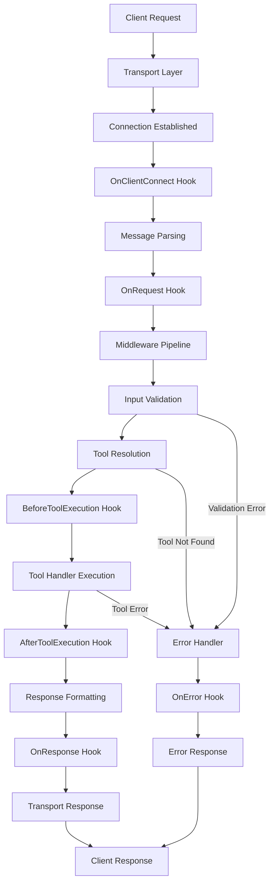

# Architecture Overview

This document provides a deep dive into the internal architecture and design decisions of MCP Accelerator.

## 🏗️ High-Level Architecture

MCP Accelerator follows a layered, modular architecture that promotes separation of concerns and extensibility:

```
┌─────────────────────────────────────────────────────────────┐
│                    MCP Client Layer                         │
│                  (Claude, Custom Apps)                      │
└─────────────────────┬───────────────────────────────────────┘
                      │ MCP Protocol
┌─────────────────────▼───────────────────────────────────────┐
│                   Transport Layer                           │
│  ┌─────────────┐ ┌─────────────┐ ┌─────────────┐ ┌─────────┐ │
│  │    HTTP     │ │ WebSocket   │ │    SSE      │ │  STDIO  │ │
│  │  Transport  │ │ Transport   │ │ Transport   │ │Transport│ │
│  └─────────────┘ └─────────────┘ └─────────────┘ └─────────┘ │
└─────────────────────┬───────────────────────────────────────┘
                      │
┌─────────────────────▼───────────────────────────────────────┐
│                 Middleware Layer                            │
│  ┌─────────────┐ ┌─────────────┐ ┌─────────────┐ ┌─────────┐ │
│  │    Auth     │ │ Rate Limit  │ │    CORS     │ │  Logging│ │
│  │ Middleware  │ │ Middleware  │ │ Middleware  │ │Middleware│ │
│  └─────────────┘ └─────────────┘ └─────────────┘ └─────────┘ │
└─────────────────────┬───────────────────────────────────────┘
                      │
┌─────────────────────▼───────────────────────────────────────┐
│                    Core Layer                               │
│  ┌─────────────┐ ┌─────────────┐ ┌─────────────┐ ┌─────────┐ │
│  │   Server    │ │Tool Manager │ │Lifecycle    │ │  Error  │ │
│  │   Core      │ │             │ │ Hooks       │ │ Handler │ │
│  └─────────────┘ └─────────────┘ └─────────────┘ └─────────┘ │
└─────────────────────┬───────────────────────────────────────┘
                      │
┌─────────────────────▼───────────────────────────────────────┐
│                  Application Layer                          │
│                   (Your Tools)                              │
└─────────────────────────────────────────────────────────────┘
```

## 🔧 Core Components

### 1. MCPServer

The central orchestrator that coordinates all components:

```typescript
class MCPServer {
  private toolManager: ToolManager;
  private middlewareStack: Middleware[];
  private lifecycleHooks: LifecycleHooks;
  private errorHandler: ErrorHandler;
  private logger: Logger;
  private metrics: MetricsCollector;
}
```

**Key Responsibilities:**
- **Request Routing**: Routes incoming requests to appropriate tools
- **Middleware Coordination**: Manages middleware execution order
- **Lifecycle Management**: Triggers lifecycle hooks at appropriate times
- **Error Handling**: Centralizes error processing and response formatting
- **Resource Management**: Manages server lifecycle and cleanup

### 2. ToolManager

Manages tool registration, validation, and execution:

```typescript
class ToolManager {
  private tools: Map<string, RegisteredTool>;
  private validator: SchemaValidator;
  private executor: ToolExecutor;
}
```

**Key Responsibilities:**
- **Tool Registration**: Stores and indexes registered tools
- **Input Validation**: Validates tool inputs against JSON schemas
- **Execution Coordination**: Manages tool execution with error handling
- **Result Formatting**: Formats tool outputs according to MCP spec

### 3. LifecycleHooks

Manages event-driven hooks throughout the request lifecycle:

```typescript
enum HookPhase {
  OnRequest = 'onRequest',
  OnResponse = 'onResponse',
  OnError = 'onError',
  BeforeToolExecution = 'beforeToolExecution',
  AfterToolExecution = 'afterToolExecution',
  OnClientConnect = 'onClientConnect',
  OnClientDisconnect = 'onClientDisconnect'
}
```

**Hook Execution Order:**
1. `OnClientConnect` - When a client connects
2. `OnRequest` - When a request is received
3. `BeforeToolExecution` - Before tool handler execution
4. `AfterToolExecution` - After tool handler execution
5. `OnResponse` - When response is ready
6. `OnError` - When an error occurs
7. `OnClientDisconnect` - When a client disconnects

### 4. ErrorHandler

Centralized error processing and response formatting:

```typescript
class ErrorHandler {
  private errorFormatters: Map<string, ErrorFormatter>;
  private logger: Logger;
  
  handle(error: Error, context: ErrorContext): MCPError {
    // Format error based on type
    // Log error with context
    // Return standardized MCP error
  }
}
```

## 🚌 Transport Layer

The transport layer abstracts communication protocols and provides a unified interface:

### Transport Interface

```typescript
interface Transport {
  start(server: MCPServer): Promise<void>;
  stop(): Promise<void>;
  onMessage(callback: MessageHandler): void;
  send(message: MCPMessage): Promise<void>;
  getConnectionInfo(): ConnectionInfo;
}
```

### HTTP Transport Implementation

Built on Fastify for high performance:

```typescript
class HTTPTransport implements Transport {
  private fastify: FastifyInstance;
  private server: MCPServer;
  
  async start(server: MCPServer): Promise<void> {
    this.fastify = fastify({
      logger: true,
      trustProxy: true,
      // Expose Fastify options for customization
      ...this.options.serverOptions
    });
    
    // Register MCP routes
    this.fastify.post('/tools/:toolName', this.handleToolRequest.bind(this));
    this.fastify.get('/tools', this.listTools.bind(this));
    this.fastify.get('/health', this.healthCheck.bind(this));
  }
}
```

### WebSocket Transport Implementation

Real-time bidirectional communication:

```typescript
class WebSocketTransport implements Transport {
  private wss: WebSocketServer;
  private connections: Map<string, WebSocket>;
  
  async start(server: MCPServer): Promise<void> {
    this.wss = new WebSocketServer({
      port: this.options.port,
      host: this.options.host,
      // WebSocket-specific options
      pingInterval: this.options.pingInterval,
      maxConnections: this.options.maxConnections
    });
    
    this.wss.on('connection', this.handleConnection.bind(this));
  }
}
```

## 🛡️ Middleware System

The middleware system provides a plugin architecture for cross-cutting concerns:

### Middleware Interface

```typescript
interface Middleware {
  name: string;
  priority: number;
  execute(context: MiddlewareContext, next: NextFunction): Promise<void>;
}
```

### Middleware Execution Pipeline

```typescript
class MiddlewarePipeline {
  private middlewares: Middleware[];
  
  async execute(context: MiddlewareContext): Promise<void> {
    let index = 0;
    
    const next = async (): Promise<void> => {
      if (index >= this.middlewares.length) return;
      
      const middleware = this.middlewares[index++];
      await middleware.execute(context, next);
    };
    
    await next();
  }
}
```

### Example Middleware Implementation

```typescript
class RateLimitMiddleware implements Middleware {
  name = 'rateLimit';
  priority = 90;
  
  async execute(context: MiddlewareContext, next: NextFunction): Promise<void> {
    const clientId = context.request.clientId;
    const isAllowed = await this.checkRateLimit(clientId);
    
    if (!isAllowed) {
      throw createMCPError(
        MCPErrorCode.RATE_LIMITED,
        'Rate limit exceeded',
        { retryAfter: 60 }
      );
    }
    
    await next();
  }
}
```

## 🔍 Observability Architecture

Built-in observability features for monitoring and debugging:

### Metrics Collection

```typescript
class MetricsCollector {
  private metrics: Map<string, Metric>;
  
  // Built-in metrics
  private requestsTotal: Counter;
  private requestDuration: Histogram;
  private activeConnections: Gauge;
  private toolExecutions: Counter;
  
  collect(): PrometheusMetrics {
    // Collect and format metrics in Prometheus format
  }
}
```

### Structured Logging

```typescript
class Logger {
  info(message: string, context?: LogContext): void;
  warn(message: string, context?: LogContext): void;
  error(message: string, error?: Error, context?: LogContext): void;
  debug(message: string, context?: LogContext): void;
}
```

### Distributed Tracing

Integration with OpenTelemetry for distributed tracing:

```typescript
class TracingMiddleware implements Middleware {
  async execute(context: MiddlewareContext, next: NextFunction): Promise<void> {
    const span = this.tracer.startSpan('mcp.tool.execution', {
      attributes: {
        'tool.name': context.toolName,
        'client.id': context.clientId
      }
    });
    
    try {
      await next();
      span.setStatus({ code: SpanStatusCode.OK });
    } catch (error) {
      span.setStatus({ code: SpanStatusCode.ERROR, message: error.message });
      throw error;
    } finally {
      span.end();
    }
  }
}
```

## 🎯 Design Decisions

### 1. Modular Architecture

**Decision**: Split functionality into separate packages
**Rationale**: 
- Allows users to install only what they need
- Enables independent versioning and updates
- Facilitates testing and maintenance
- Promotes code reuse

### 2. Transport Abstraction

**Decision**: Abstract transport layer with unified interface
**Rationale**:
- Allows switching between protocols without changing application code
- Enables testing with different transports
- Supports multiple transports simultaneously
- Facilitates adding new transport types

### 3. Middleware Pipeline

**Decision**: Use priority-based middleware execution
**Rationale**:
- Provides predictable execution order
- Enables fine-grained control over middleware behavior
- Supports conditional middleware execution
- Facilitates debugging and testing

### 4. Lifecycle Hooks

**Decision**: Event-driven lifecycle management
**Rationale**:
- Provides extensibility points without modifying core code
- Enables observability and monitoring
- Supports custom behavior injection
- Facilitates testing and mocking

### 5. Centralized Error Handling

**Decision**: Unified error processing and formatting
**Rationale**:
- Ensures consistent error responses
- Provides standardized error codes and messages
- Enables error logging and monitoring
- Facilitates debugging and troubleshooting

## 🔄 Request Flow

Detailed request processing flow:



## 🚀 Performance Optimizations

### 1. Connection Pooling

WebSocket connections are pooled and reused to minimize connection overhead.

### 2. Request Batching

Multiple requests can be batched together to reduce network round trips.

### 3. Lazy Loading

Middleware and tools are loaded on-demand to reduce startup time.

### 4. Memory Management

Efficient memory usage with proper cleanup and garbage collection.

### 5. Caching

Tool schemas and validation results are cached to improve performance.

## 🔐 Security Considerations

### 1. Input Validation

All inputs are validated against JSON schemas before processing.

### 2. Authentication

Multiple authentication methods supported through middleware.

### 3. Rate Limiting

Built-in protection against abuse and DoS attacks.

### 4. CORS

Configurable CORS policies for web-based clients.

### 5. Error Information

Sensitive information is filtered from error responses.

## 📚 Extension Points

The architecture provides several extension points:

1. **Custom Transports**: Implement the `Transport` interface
2. **Custom Middleware**: Implement the `Middleware` interface
3. **Custom Error Formatters**: Implement the `ErrorFormatter` interface
4. **Custom Lifecycle Hooks**: Register custom hook handlers
5. **Custom Metrics**: Add application-specific metrics
6. **Custom Logging**: Implement custom log handlers

## 🔄 Future Considerations

### 1. Plugin System

A more formal plugin system for third-party extensions.

### 2. Clustering

Support for horizontal scaling across multiple instances.

### 3. Persistence

Optional persistence layer for tool state and configuration.

### 4. Streaming

Native support for streaming responses and real-time data.

### 5. GraphQL

Optional GraphQL transport for more flexible querying.

---

*This architecture is designed to be both powerful and flexible, allowing you to build sophisticated MCP servers while maintaining simplicity and performance.*
