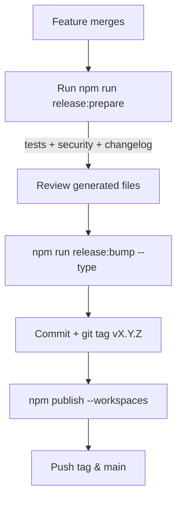

# Release Management

This guide documents the automated workflow introduced in Phase 4.3 for generating changelogs, bumping versions, and publishing packages while enforcing continuous quality checks.

## Prerequisites

- Node.js 18+
- Access to the Git repository with push permissions
- npm credentials with publish rights for the `@mcp-accelerator` scope
- (Optional) [Snyk CLI](https://docs.snyk.io/snyk-cli/install-the-snyk-cli) configured for security testing

## Release Pipeline Overview



## Step 1 — Prepare the Release

```bash
npm run release:prepare
```

This command executes:

1. `npm run test:ci` – Jest test matrix with coverage.
2. `npm run security:audit` – `npm audit --production` for known vulnerabilities.
3. `npm run security:licenses` – License inventory using `package-lock.json`.
4. `npm run changelog` – Generates a changelog section from conventional commits since the last tag.

If you have Snyk configured, run the optional scan:

```bash
npm run security:snyk
```

> **Note:** The Snyk command is tolerant to absence of credentials and will not block the release if unavailable.

## Step 2 — Bump Versions

Choose the semantic version increment:

```bash
# Patch release (default)
npm run release:bump

# Minor release
npm run release:bump -- --type=minor

# Major release
npm run release:bump -- --type=major
```

The script updates:

- Root `package.json`
- All workspace `package.json` files
- `package-lock.json` entries for internal packages

After the bump, review the diffs (especially the changelog and package manifests).

## Step 3 — Commit and Tag

```bash
git status
git add .
git commit -m "chore(release): vX.Y.Z"
git tag vX.Y.Z
```

> Replace `X.Y.Z` with the version emitted by the bump script.

## Step 4 — Publish Packages

```bash
npm publish --workspaces --access public
```

If you prefer dry runs or staged rollouts, append `--dry-run` and validate the output before the real publish.

## Step 5 — Push Artifacts

```bash
git push origin main
git push origin vX.Y.Z
```

Publishing the tag ensures GitHub releases and downstream automation can pick up the new version.

## Continuous Quality Hooks

- **Changelog generation** uses conventional commits (`feat`, `fix`, `docs`, etc.). Ensure pull requests follow the convention to produce clean release notes.
- **License reporting** surfaces unknown or missing license fields. Resolve discrepancies before shipping.
- **Security scans**: integrate `npm run release:prepare` and `npm run security:snyk` into CI to catch regressions early.

This process keeps the MCP Accelerator packages aligned across the monorepo, maintains an auditable changelog, and enforces security hygiene before every release.
