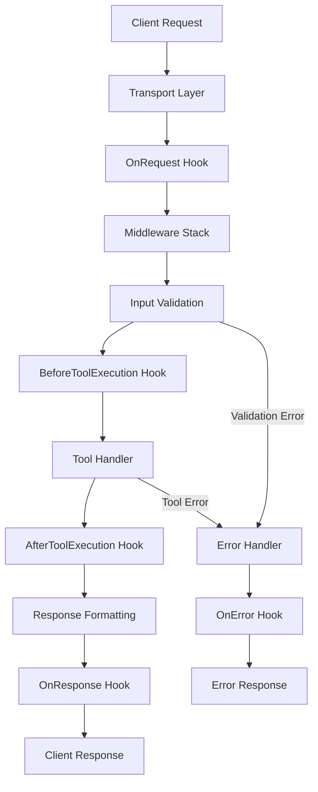

# Core Concepts

Understanding the fundamental concepts of MCP Accelerator will help you build robust and scalable MCP servers.

## 🏗️ Architecture Overview

MCP Accelerator follows a modular architecture with clear separation of concerns:

```
┌─────────────────┐    ┌──────────────────┐    ┌─────────────────┐
│   MCP Client    │    │   MCP Accelerator │    │   Your Tools    │
│                 │◄──►│                  │◄──►│                 │
│  (Claude, etc.) │    │                  │    │  (Business      │
│                 │    │  ┌─────────────┐ │    │   Logic)        │
└─────────────────┘    │  │   Core      │ │    └─────────────────┘
                       │  │   Server    │ │
                       │  └─────────────┘ │
                       │  ┌─────────────┐ │
                       │  │ Middleware  │ │
                       │  │   Stack     │ │
                       │  └─────────────┘ │
                       │  ┌─────────────┐ │
                       │  │  Transport  │ │
                       │  │    Layer    │ │
                       │  └─────────────┘ │
                       └──────────────────┘
```

## 🎯 Key Components

### 1. MCPServer (Core)

The central orchestrator that manages the entire MCP server lifecycle.

```typescript
import { MCPServer } from '@mcp-accelerator/core';

const server = new MCPServer({
  name: 'My Server',
  version: '1.0.0',
  description: 'A powerful MCP server'
});
```

**Responsibilities:**
- Tool registration and management
- Request routing and validation
- Lifecycle event coordination
- Error handling and logging

### 2. Tools

Tools are the core functionality of your MCP server. Each tool represents a capability that clients can invoke.

```typescript
interface ToolDefinition {
  name: string;                    // Unique identifier
  description: string;             // Human-readable description
  inputSchema: JSONSchema;         // Input validation schema
  handler: ToolHandler;           // Async function that processes requests
}
```

**Tool Lifecycle:**
1. **Registration**: Tool is registered with the server
2. **Validation**: Input is validated against the schema
3. **Execution**: Handler function is called with validated input
4. **Response**: Result is formatted and returned to client

### 3. Transports

Transports define how your server communicates with MCP clients.

#### HTTP Transport
```typescript
import { HTTPTransport } from '@mcp-accelerator/transport-http';

const transport = new HTTPTransport({
  port: 3000,
  host: 'localhost',
  // Exposes Fastify options
  serverOptions: {
    logger: true,
    trustProxy: true
  }
});
```

#### WebSocket Transport
```typescript
import { WebSocketTransport } from '@mcp-accelerator/transport-websocket';

const transport = new WebSocketTransport({
  port: 3000,
  // WebSocket-specific options
  pingInterval: 30000,
  maxConnections: 100
});
```

#### STDIO Transport
```typescript
import { STDIOTransport } from '@mcp-accelerator/transport-stdio';

const transport = new STDIOTransport({
  // For CLI tools and direct integration
});
```

### 4. Middleware

Middleware adds cross-cutting concerns like authentication, logging, and rate limiting.

```typescript
// Middleware execution order (by priority)
server.use(new AuthenticationMiddleware({ /* config */ }));  // Priority: 100
server.use(new RateLimitMiddleware({ /* config */ }));       // Priority: 90
server.use(new CORSMiddleware({ /* config */ }));            // Priority: 80
server.use(new LoggingMiddleware({ /* config */ }));         // Priority: 70
```

## 🔄 Request Lifecycle

Understanding the request lifecycle helps you debug issues and optimize performance:



### Lifecycle Hooks

```typescript
// Request lifecycle hooks
server.onRequest((context) => {
  console.log('Request started:', context.request);
  context.startTime = Date.now();
});

server.onResponse((context) => {
  const duration = Date.now() - context.startTime;
  console.log('Request completed in:', duration, 'ms');
});

server.onError((context) => {
  console.error('Request failed:', context.error);
});

// Tool execution hooks
server.beforeToolExecution((context) => {
  console.log('Executing tool:', context.toolName);
});

server.afterToolExecution((context) => {
  console.log('Tool completed:', context.result);
});
```

## 🛡️ Error Handling

MCP Accelerator provides robust error handling with standardized error types:

### Error Types

```typescript
enum MCPErrorCode {
  VALIDATION_ERROR = 'VALIDATION_ERROR',
  TOOL_NOT_FOUND = 'TOOL_NOT_FOUND',
  INTERNAL_ERROR = 'INTERNAL_ERROR',
  TIMEOUT = 'TIMEOUT',
  RATE_LIMITED = 'RATE_LIMITED',
  UNAUTHORIZED = 'UNAUTHORIZED'
}
```

### Creating Errors

```typescript
import { createMCPError, MCPErrorCode } from '@mcp-accelerator/core';

// Simple error
throw createMCPError(MCPErrorCode.VALIDATION_ERROR, 'Invalid input');

// Error with details
throw createMCPError(
  MCPErrorCode.INTERNAL_ERROR,
  'Database connection failed',
  { 
    error: 'Connection timeout',
    retryAfter: 30 
  }
);
```

### Safe Tool Handlers

Use the `safeHandler` utility to prevent crashes:

```typescript
import { safeHandler } from '@mcp-accelerator/core';

const robustTool = safeHandler(
  async (input) => {
    // Your tool logic here
    return await processInput(input);
  },
  {
    timeout: 5000,        // 5 second timeout
    retry: {              // Retry configuration
      attempts: 3,
      delay: 1000
    },
    circuitBreaker: {     // Circuit breaker
      threshold: 5,
      timeout: 30000
    }
  }
);

server.addTool(toolDefinition, robustTool);
```

## 🔍 Observability

Built-in observability features help you monitor and debug your MCP server:

### Metrics

```typescript
// Built-in metrics
server.getMetrics(); // Returns Prometheus-compatible metrics

// Custom metrics
server.addCustomMetric('tool_executions_total', 'counter');
server.addCustomMetric('request_duration_seconds', 'histogram');
```

### Logging

```typescript
// Structured logging with context
server.logger.info('Tool executed', {
  toolName: 'search',
  duration: 150,
  userId: 'user123'
});

// Error logging with stack traces
server.logger.error('Tool failed', error, {
  toolName: 'search',
  input: sanitizedInput
});
```

### Tracing

```typescript
// OpenTelemetry integration
import { createTracer } from '@mcp-accelerator/middleware-observability';

const tracer = createTracer('my-mcp-server');

server.use(new TracingMiddleware({ tracer }));
```

## 🚀 Performance Considerations

### 1. Tool Registration

Register tools once during server initialization:

```typescript
// ✅ Good - Register during setup
server.addTool(searchTool, searchHandler);
server.addTool(analyzeTool, analyzeHandler);

// ❌ Avoid - Don't register tools per request
```

### 2. Input Validation

Use efficient JSON Schema validation:

```typescript
// ✅ Good - Specific schemas
const schema = {
  type: 'object',
  properties: {
    query: { type: 'string', maxLength: 1000 },
    limit: { type: 'number', minimum: 1, maximum: 100 }
  },
  required: ['query']
};

// ❌ Avoid - Overly permissive schemas
const schema = {
  type: 'object'
};
```

### 3. Resource Management

Clean up resources properly:

```typescript
// Graceful shutdown
process.on('SIGTERM', async () => {
  await server.stop();
  process.exit(0);
});

process.on('SIGINT', async () => {
  await server.stop();
  process.exit(0);
});
```

## 🔐 Security Best Practices

### 1. Input Sanitization

Always validate and sanitize inputs:

```typescript
import { z } from 'zod';

const inputSchema = z.object({
  query: z.string().max(1000).regex(/^[a-zA-Z0-9\s]+$/),
  userId: z.string().uuid()
});

const handler = safeHandler(async (input) => {
  const validated = inputSchema.parse(input);
  // Process validated input
});
```

### 2. Authentication

Use the helper to wire JWT/API key authentication quickly:

```typescript
import { applyDefaultSecurity } from 'mcp-accelerator';

await applyDefaultSecurity(server, {
  auth: {
    jwt: { secret: process.env.MCP_JWT_SECRET },
    apiKey: { keys: process.env.MCP_API_KEYS?.split(',') },
  },
});
```

Or register custom middleware manually:

```typescript
import { JWTAuthMiddleware } from '@mcp-accelerator/middleware-auth';

server.use(new JWTAuthMiddleware({
  secret: process.env.JWT_SECRET,
  algorithms: ['HS256']
}));
```

### 3. Rate Limiting

Protect against abuse:

`applyDefaultSecurity` also wires a rate limit middleware when `MCP_RATE_LIMIT_MAX` (per minute) is defined. For custom strategies, compose middlewares manually:

```typescript
import { createRateLimitMiddleware } from '@mcp-accelerator/middleware-ratelimit';

server.registerMiddleware(createRateLimitMiddleware({
  windowMs: 15 * 60 * 1000,
  max: 100,
  keyGenerator: (context) => context.clientId ?? 'anonymous',
}));
```

## 📚 Next Steps

Now that you understand the core concepts:

1. **[Transport Layer](./transports.md)** - Choose the right transport for your use case
2. **[Middleware System](./middleware.md)** - Add authentication, rate limiting, and more
3. **[Error Handling](./error-handling.md)** - Implement robust error handling
4. **[Production Deployment](./production.md)** - Deploy to production safely

---

*Ready to dive deeper? Let's explore the [Transport Layer](./transports.md)!* 🚀
