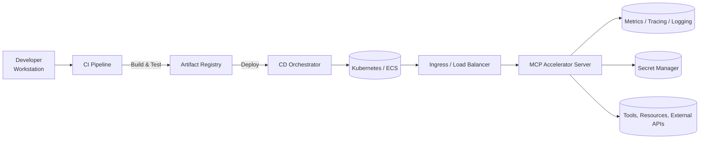

# Deployment & Operations

This guide consolidates MCP Accelerator deployment practices so you can ship compliant servers in production. The recommendations align with the [Model Context Protocol](https://modelcontextprotocol.io/docs/getting-started/intro) requirements for capability negotiation, security, and resilience.

## Operational Goals

- **Repeatable builds**: deterministic TypeScript compilation and tests.
- **Environment parity**: the same transports, tools, and middleware across development, staging, and production.
- **Safe rollout**: health checks, traffic shifting, and rollback plans.
- **Observability-first**: metrics, logs, and traces available at launch.

## Step-by-Step Deployment Pipeline

1. **Prepare artifacts**
   ```bash
   npm ci
   npm run build
   npm pack --pack-destination dist/npm-artifacts
   ```
2. **Run automated checks**
   ```bash
   npm test
   npm run lint
   npx mcp-accelerator doctor --project .
   ```
3. **Bake container image (optional)**
   ```Dockerfile
   FROM node:20-alpine AS build
   WORKDIR /app
   COPY package*.json ./
   RUN npm ci
   COPY . .
   RUN npm run build

   FROM node:20-alpine AS runtime
   WORKDIR /app
   ENV NODE_ENV=production
   COPY --from=build /app/package*.json ./
   COPY --from=build /app/dist ./dist
   RUN npm ci --omit=dev
   CMD ["node", "dist/index.js"]
   ```
4. **Provision infrastructure**
   - Containers: Kubernetes (`Deployment`, `Service`, `Ingress`) or ECS.
   - Serverless: wrap STDIO transport inside AWS Lambda or Cloud Run ingress.
   - Bare metal: systemd service with socket activation for STDIO transport.
5. **Configure runtime**
   - Set environment variables for transports, security, observability, and tools.
   - Mount secrets (JWT keys, API keys) using platform secret stores.
   - Expose health endpoints (`/health`, `/metrics`) behind load balancers.
6. **Rollout strategy**
   - **Blue/Green**: run a new replica set, verify health, then switch traffic.
   - **Canary**: send a small percentage of traffic to the new version and monitor metrics.
   - **Feature flags**: toggle tools or resource providers using metadata in `StrictMetadata`.
7. **Post-deployment validation**
   ```bash
   curl -fsS https://your-server.example.com/health
   curl -fsS https://your-server.example.com/tools | jq '.capabilities'
   ```
   Confirm negotiated capabilities match the activated providers and transports.

## Reference Architecture



- **CI pipeline** runs the MCP doctor, Jest suites, and lints to keep scaffolding accurate.
- **Artifact registry** stores npm tarballs or container images for reproducible rollouts.
- **Observability stack** (Prometheus, Grafana, Jaeger) attaches to transports and middleware.
- **Secret manager** injects credentials during deployment; the codebase never embeds secrets.

## Environment Profiles

| Profile | Goals | Configuration |
|---------|-------|---------------|
| Development | Fast iteration, verbose logs | STDIO transport, `SilentLogger` disabled, rate limits relaxed. |
| Staging | Production parity | HTTP/WebSocket transports, full middleware stack, telemetry exporters pointing to staging backend. |
| Production | Reliability, scale | Multiple replicas, auto-scaling, TLS termination, aggressive rate limiting, emergency feature flags. |

Use `.env.development`, `.env.staging`, `.env.production` files (stored securely) or platform-specific configuration objects. The CLI generators create directory structures compatible with this pattern.

## Health & Readiness

- `/health`: quick readiness probe, returns `200` when transports, middleware, and tool registry are initialized.
- `/metrics`: Prometheus endpoint with transport-level counters.
- Graceful shutdown: call `await server.stop()` during `SIGTERM` to drain requests.
- Auto-scaling: base thresholds on latency percentiles (`p95`, `p99`) and queue depth metrics.

## Disaster Recovery

- Back up plugin manifests and resource provider catalogs.
- Automate `server.dumpState()` (if implemented) or export tool metadata for auditing.
- Plan for rotating JWT/API keys without downtime—maintain overlapping key sets.
- Document manual rollback steps; store them with runbooks in version control.

Following this workflow ensures every deployment carries the exact MCP capabilities, security posture, and observability signals required for safe operation.
