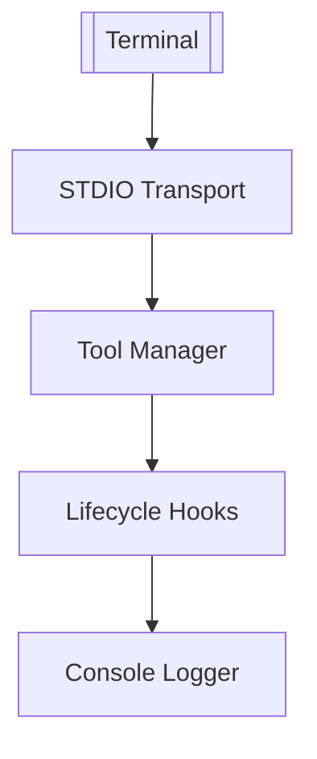
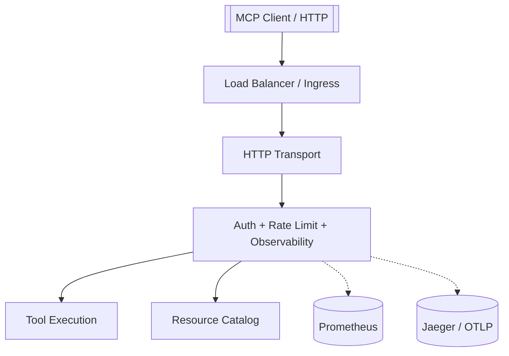

# Step-by-Step Tutorials

These guided walkthroughs help you apply MCP Accelerator features in real-world scenarios. Each tutorial follows the [Model Context Protocol](https://modelcontextprotocol.io/docs/getting-started/intro) conventions so capabilities stay truthful from development to production.

## Tutorial 1 – Build a CLI Assistant with STDIO

### Goal
Create a command-line assistant that exposes tools over the STDIO transport. Ideal for integrating with terminal workflows or local automation.

### Architecture


### Steps

1. **Scaffold the project**
   ```bash
   npx mcp-accelerator create-project cli-assistant --transport stdio
   cd cli-assistant
   npm install
   ```
2. **Generate a tool**
   ```bash
   npx mcp-accelerator generate tool summarize \
     --description "Summarize text input"
   ```
   Update `src/tools/summarize.ts` to call your summarization logic (local library, API, or built-in algorithm).
3. **Register tools**
   ```typescript
   import { summarizeTool } from './tools/summarize';

   server.registerTool(summarizeTool);
   ```
4. **Run in watch mode**
   ```bash
   npm run dev
   ```
5. **Test with a compatible client**
   ```bash
   echo '{"type":"request","id":"1","method":"tools/call","params":{"name":"summarize","arguments":{"example":"MCP Accelerator is awesome"}}}' \
     | node dist/index.js
   ```
6. **Add observability (optional)**
   ```bash
   export OTEL_SERVICE_NAME=cli-assistant
   ```
   Re-run `applyDefaultSecurity` to capture structured logs even in STDIO mode.

### Next Steps
- Add rate limiting to prevent abuse when embedding in automation pipelines.
- Promote to an HTTP or WebSocket transport for remote access while keeping the same tool definitions.

## Tutorial 2 – Deploy an HTTP Server with Observability

### Goal
Expose tools over HTTPS, enable authentication, and stream metrics to Prometheus while keeping the implementation compliant with MCP capabilities.

### Architecture


### Steps

1. **Create the project**
   ```bash
   npx mcp-accelerator create-project http-observability --transport http
   cd http-observability
   npm install
   ```
2. **Enable security helpers**
   ```bash
   npm install \
     @mcp-accelerator/middleware-auth \
     @mcp-accelerator/middleware-ratelimit \
     @mcp-accelerator/middleware-observability
   ```
3. **Configure environment**
   ```bash
   export MCP_JWT_SECRET=$(openssl rand -hex 32)
   export MCP_API_KEYS="internal-ci"
   export OTEL_SERVICE_NAME=http-observability
   export OTEL_METRICS_EXPORTER=prometheus
   ```
4. **Register tools and resources**
   ```bash
   npx mcp-accelerator generate tool health-check \
     --description "Return server metadata"

   npx mcp-accelerator generate resource docs \
     --description "Serve API documentation"
   ```
   Update `src/index.ts` to register the generated providers.
5. **Run locally**
   ```bash
   npm run dev
   curl http://localhost:3000/health
   curl http://localhost:3000/tools | jq '.tools[].name'
   ```
6. **Package for deployment**
   ```bash
   npm run build
   docker build -t your-registry/http-observability:latest .
   docker run -p 3000:3000 \
     -e MCP_JWT_SECRET -e MCP_API_KEYS \
     -e OTEL_SERVICE_NAME -e OTEL_METRICS_EXPORTER \
     your-registry/http-observability:latest
   ```
7. **Verify telemetry**
   - `curl http://localhost:3000/metrics` shows transport and middleware metrics.
   - Traces appear in Jaeger or your OTLP backend with spans for each request.

### Next Steps
- Configure TLS termination at the load balancer.
- Scale horizontally by adding replicas behind the load balancer.
- Use feature flags (metadata-driven) to roll out new tools safely.

## Additional Exercises

- Create a WebSocket transport tutorial for low-latency streaming.
- Extend the CLI assistant with prompt providers and broadcast updates to clients.
- Integrate the plugin manager into the deployment pipeline and audit installations with `mcp-accelerator plugins audit`.

Keep iterating: the CLI generators, observability tools, and deployment guides in this documentation give you a consistent path from prototype to production.
